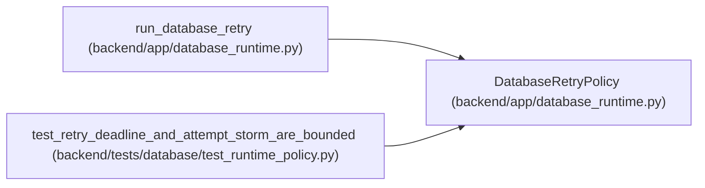

# DatabaseRetryPolicy

**Location:** `backend/app/database_runtime.py:55`
**Kind:** Class
**Bases:** —
**Module:** [database_runtime](../modules/database_runtime.md)

**Decorators:** `@dataclass(frozen=True)`

## Description

A short retry budget that cannot outlive the request deadline.

## Attributes

| Name | Type | Default | Description |
|------|------|---------|-------------|
| `max_attempts` | `int` | `3` | — |
| `base_delay_seconds` | `float` | `0.025` | — |
| `max_delay_seconds` | `float` | `0.25` | — |
| `deadline_seconds` | `float` | `1.0` | — |

## Methods

| Method | Signature | Decorators | Description |
|--------|-----------|------------|-------------|
| `__post_init__` | `() -> None` | — | — |

## Relationships

<!-- Auto-generated relationship summary. Do not edit by hand. -->

### Summary

| Module | Methods | Attributes |
|---|---:|---|
| [database_runtime](../modules/database_runtime.md) | 1 | `base_delay_seconds`, `deadline_seconds`, `max_attempts`, `max_delay_seconds` |

### References

| Reference | Kind | Source | Call sites |
|---|---|---|---:|
| `run_database_retry` | type_reference | [database_runtime](../modules/database_runtime.md) | — |
| `test_retry_deadline_and_attempt_storm_are_bounded` | call | [test_runtime_policy](../modules/test_runtime_policy.md) | 1 |
