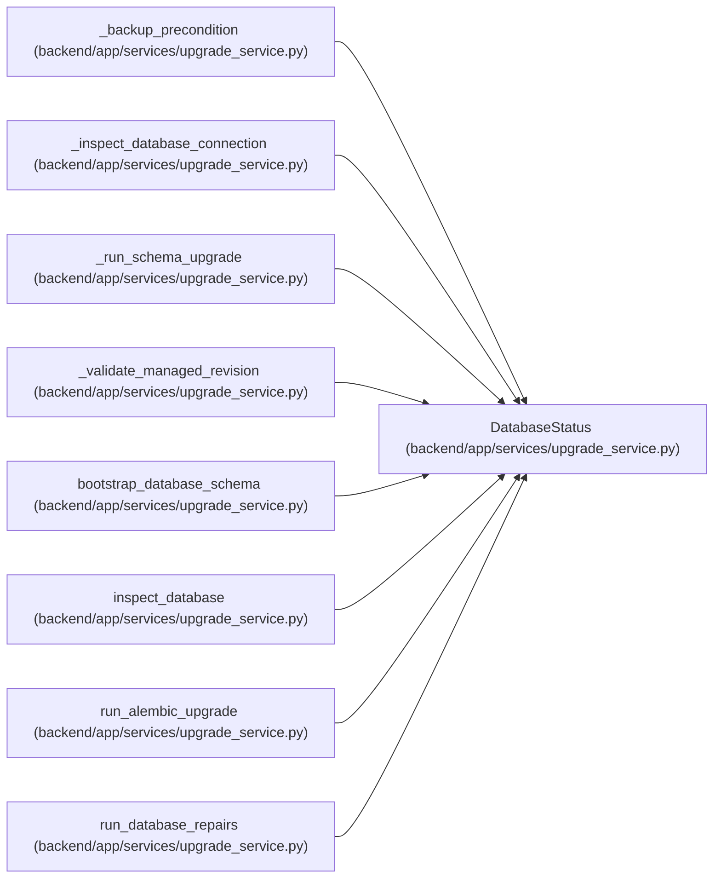

# DatabaseStatus

**Location:** `backend/app/services/upgrade_service.py:75`
**Kind:** Class
**Bases:** —
**Module:** [upgrade_service](../modules/upgrade_service.md)

**Decorators:** `@dataclass(frozen=True)`

## Description

Inspected database schema state.

## Attributes

| Name | Type | Default | Description |
|------|------|---------|-------------|
| `state` | `DatabaseState` | *required* | — |
| `current_revision` | `Optional[str]` | *required* | — |
| `head_revision` | `str` | *required* | — |
| `table_count` | `int` | *required* | — |
| `tables` | `list[str]` | *required* | — |

## Methods

| Method | Signature | Decorators | Description |
|--------|-----------|------------|-------------|
| `is_current` | `() -> bool` | `@property` | — |
| `needs_upgrade` | `() -> bool` | `@property` | — |

## Relationships

<!-- Auto-generated relationship summary. Do not edit by hand. -->

### Summary

| Module | Methods | Attributes |
|---|---:|---|
| [upgrade_service](../modules/upgrade_service.md) | 2 | `current_revision`, `head_revision`, `state`, `table_count`, `tables` |

### References

| Reference | Kind | Source | Call sites |
|---|---|---|---:|
| `_backup_precondition` | type_reference | [upgrade_service](../modules/upgrade_service.md) | — |
| `_inspect_database_connection` | call | [upgrade_service](../modules/upgrade_service.md) | 1 |
| `_inspect_database_connection` | type_reference | [upgrade_service](../modules/upgrade_service.md) | — |
| `_run_schema_upgrade` | type_reference | [upgrade_service](../modules/upgrade_service.md) | — |
| `_validate_managed_revision` | type_reference | [upgrade_service](../modules/upgrade_service.md) | — |
| `bootstrap_database_schema` | type_reference | [upgrade_service](../modules/upgrade_service.md) | — |
| `inspect_database` | type_reference | [upgrade_service](../modules/upgrade_service.md) | — |
| `run_alembic_upgrade` | type_reference | [upgrade_service](../modules/upgrade_service.md) | — |
| `run_database_repairs` | type_reference | [upgrade_service](../modules/upgrade_service.md) | — |
