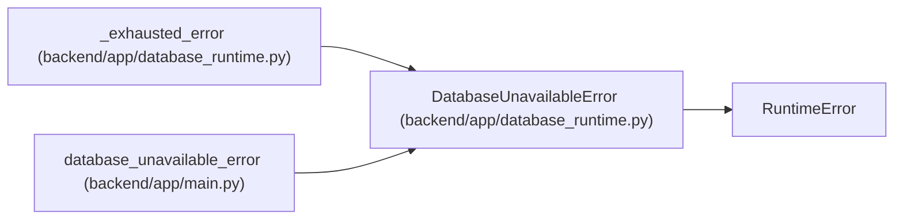

# DatabaseUnavailableError

**Location:** `backend/app/database_runtime.py:50`
**Kind:** Class
**Bases:** `RuntimeError`
**Module:** [database_runtime](../modules/database_runtime.md)

## Description

A retryable database availability failure exhausted its budget.

## Attributes

*No annotated attributes found.*

## Methods

*No public methods. Inherits from base classes.*

## Relationships

<!-- Auto-generated relationship summary. Do not edit by hand. -->

### Summary

| Module | Methods | Attributes |
|---|---:|---|
| [database_runtime](../modules/database_runtime.md) | 0 | — |

### Structure

| Kind | Entity | Module |
|---|---|---|
| Base | `RuntimeError` | — |

### References

| Reference | Kind | Source | Call sites |
|---|---|---|---:|
| `_exhausted_error` | call | [database_runtime](../modules/database_runtime.md) | 1 |
| `database_unavailable_error` | type_reference | [app_main](../modules/app_main.md) | — |
