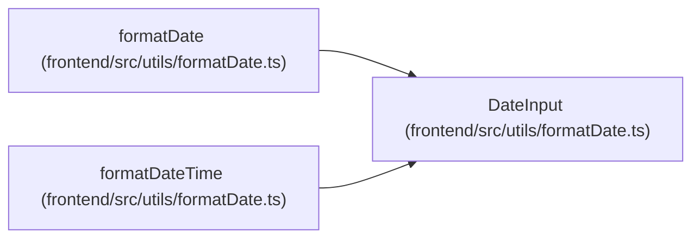

# DateInput

**Location:** `frontend/src/utils/formatDate.ts:4`
**Kind:** Type alias
**Bases:** —
**Module:** [formatDate](../modules/formatDate.md)

## Description

_Auto-generated from `DateInput` in `frontend/src/utils/formatDate.ts`._

## Attributes

*No annotated attributes found.*

## Methods

*No public methods. Inherits from base classes.*

## Relationships

<!-- Auto-generated relationship summary. Do not edit by hand. -->

### Summary

| Module | Methods | Attributes |
|---|---:|---|
| [formatDate](../modules/formatDate.md) | 0 | — |

### References

| Reference | Kind | Source | Call sites |
|---|---|---|---:|
| `formatDate` | type_reference | [formatDate](../modules/formatDate.md) | — |
| `formatDateTime` | type_reference | [formatDate](../modules/formatDate.md) | — |
