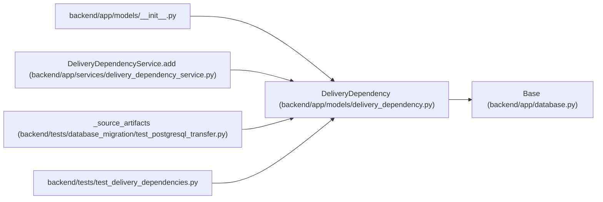

# DeliveryDependency

**Location:** `backend/app/models/delivery_dependency.py:9`
**Kind:** Class
**Bases:** `Base`
**Module:** [delivery_dependency](../modules/delivery_dependency.md)

## Description

A dependent task points to exactly one prerequisite task or milestone. Targets are protected from implicit deletion; local schedule edges remain a separate relation.

## Attributes

| Name | Type | Default | Description |
|------|------|---------|-------------|
| `id` | `Mapped[int]` | `mapped_column(Integer, primary_key=True)` | — |
| `task_id` | `Mapped[int]` | `mapped_column(ForeignKey('tasks.id', ondelete='CASCADE'), index=True)` | — |
| `prerequisite_task_id` | `Mapped[int \| None]` | `mapped_column(ForeignKey('tasks.id', ondelete='RESTRICT'), index=True)` | — |
| `prerequisite_milestone_id` | `Mapped[int \| None]` | `mapped_column(ForeignKey('project_milestones.id', ondelete='RESTRICT'), index=True)` | — |

## Methods

*No public methods. Inherits from base classes.*

## Relationships

<!-- Auto-generated relationship summary. Do not edit by hand. -->

### Summary

| Module | Methods | Attributes |
|---|---:|---|
| [delivery_dependency](../modules/delivery_dependency.md) | 0 | `id`, `prerequisite_milestone_id`, `prerequisite_task_id`, `task_id` |

### Structure

| Kind | Entity | Module |
|---|---|---|
| Base | `Base` | [app_database](../modules/app_database.md) |

### References

| Reference | Kind | Source | Call sites |
|---|---|---|---:|
| `__init__` | import | [models___init__](../modules/models___init__.md) | — |
| `DeliveryDependencyService.add` | call | [delivery_dependency_service](../modules/delivery_dependency_service.md) | 1 |
| `_source_artifacts` | call | [test_postgresql_transfer](../modules/test_postgresql_transfer.md) | 2 |
| `test_delivery_dependencies` | import | [test_delivery_dependencies](../modules/test_delivery_dependencies.md) | — |
