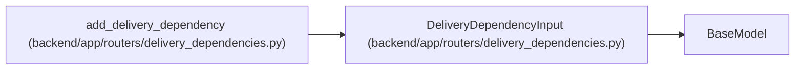

# DeliveryDependencyInput

**Location:** `backend/app/routers/delivery_dependencies.py:17`
**Kind:** Pydantic model
**Bases:** `BaseModel`
**Module:** [delivery_dependencies](../modules/delivery_dependencies.md)

## Description

_Auto-generated from `DeliveryDependencyInput` in `backend/app/routers/delivery_dependencies.py`._

## Attributes

| Name | Type | Wire name | Required | Nullable | Default | Constraints | Examples | Description |
|------|------|-----------|----------|----------|---------|-------------|-------------|----------|
| `kind` | `Literal['task', 'milestone']` | `kind` | Yes | No | — | — | — | — |
| `target_id` | `int` | `target_id` | Yes | No | — | gt=0 | — | — |
| `expected_version` | `int` | `expected_version` | Yes | No | — | gt=0 | — | — |

## Methods

*No public methods. Inherits from base classes.*

## Relationships

<!-- Auto-generated relationship summary. Do not edit by hand. -->

### Summary

| Module | Methods | Attributes |
|---|---:|---|
| [delivery_dependencies](../modules/delivery_dependencies.md) | 0 | `expected_version`, `kind`, `target_id` |

### Structure

| Kind | Entity | Module |
|---|---|---|
| Base | `BaseModel` | — |

### References

| Reference | Kind | Source | Call sites |
|---|---|---|---:|
| `add_delivery_dependency` | type_reference | [delivery_dependencies](../modules/delivery_dependencies.md) | — |
