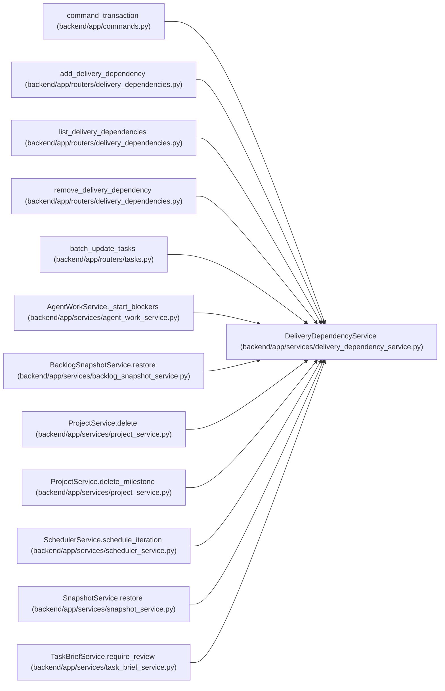

# DeliveryDependencyService

**Location:** `backend/app/services/delivery_dependency_service.py:14`
**Kind:** Class
**Bases:** —
**Module:** [delivery_dependency_service](../modules/delivery_dependency_service.md)

## Description

Shared delivery policy for authorized endpoint commands, global cycle checks, current attributed acceptance, generic private-target blockers and transactional downstream invalidation.

## Attributes

*No annotated attributes found.*

## Methods

| Method | Signature | Decorators | Description |
|--------|-----------|------------|-------------|
| `__init__` | `(db)` | — | — |
| `graph` | *(async)* `()` | — | Only identifiers enter the internal graph; no hidden work is serialized. |
| `validate_cycles` | *(async)* `()` | — | — |
| `projection` | *(async)* `(task_id)` | — | — |
| `_accepted` | *(async)* `(kind, target)` | — | — |
| `ready` | *(async)* `(task_id)` | — | — |
| `add` | *(async)* `(task_id, kind, target_id, expected_version)` | `@atomic_command` | — |
| `remove` | *(async)* `(task_id, edge_id, expected_version)` | `@atomic_command` | — |
| `require_unreferenced` | *(async)* `(task_ids = (), milestone_id = None)` | — | — |
| `reconcile` | *(async)* `()` | — | — |

## Relationships

<!-- Auto-generated relationship summary. Do not edit by hand. -->

### Summary

| Module | Methods | Attributes |
|---|---:|---|
| [delivery_dependency_service](../modules/delivery_dependency_service.md) | 10 | — |

### References

| Reference | Kind | Source | Call sites |
|---|---|---|---:|
| `command_transaction` | call | [commands](../modules/commands.md) | 1 |
| `add_delivery_dependency` | call | [delivery_dependencies](../modules/delivery_dependencies.md) | 1 |
| `list_delivery_dependencies` | call | [delivery_dependencies](../modules/delivery_dependencies.md) | 1 |
| `remove_delivery_dependency` | call | [delivery_dependencies](../modules/delivery_dependencies.md) | 1 |
| `batch_update_tasks` | call | [tasks](../modules/tasks.md) | 1 |
| `AgentWorkService._start_blockers` | call | [agent_work_service](../modules/agent_work_service.md) | 1 |
| `BacklogSnapshotService.restore` | call | [backlog_snapshot_service](../modules/backlog_snapshot_service.md) | 1 |
| `ProjectService.delete` | call | [project_service](../modules/project_service.md) | 2 |
| `ProjectService.delete_milestone` | call | [project_service](../modules/project_service.md) | 1 |
| `SchedulerService.schedule_iteration` | call | [scheduler_service](../modules/scheduler_service.md) | 1 |
| `SnapshotService.restore` | call | [snapshot_service](../modules/snapshot_service.md) | 1 |
| `TaskBriefService.require_review` | call | [task_brief_service](../modules/task_brief_service.md) | 1 |

> References: showing 12 of 20 logical references; 8 omitted by the 12-row generated summary limit.
