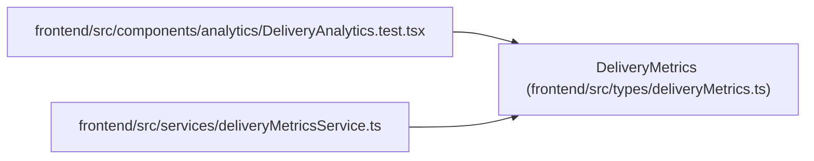

# DeliveryMetrics

**Location:** `frontend/src/types/deliveryMetrics.ts:17`
**Kind:** Class
**Bases:** —
**Module:** [deliveryMetrics](../modules/deliveryMetrics.md)

## Description

_Auto-generated from `DeliveryMetrics` in `frontend/src/types/deliveryMetrics.ts`._

## Attributes

| Name | Type | Required | Default | Description |
|------|------|----------|---------|-------------|
| `contract_version` | `number` | Yes | — | — |
| `window_start` | `string` | Yes | — | — |
| `window_end` | `string` | Yes | — | — |
| `scope_basis` | `string` | Yes | — | — |
| `accepted_leaf_tasks` | `number` | Yes | — | — |
| `acceptance_events` | `number` | Yes | — | — |
| `rejection_events` | `number` | Yes | — | — |
| `canceled_leaf_tasks` | `number` | Yes | — | — |
| `reopened_events` | `number` | Yes | — | — |
| `lead_time` | `DurationSamples` | Yes | — | — |
| `cycle_time` | `DurationSamples` | Yes | — | — |
| `review_delay` | `DurationSamples` | Yes | — | — |
| `coverage` | `Record<string, number \| string>` | Yes | — | — |
| `review_queue` | `DeliveryQueueItem[]` | Yes | — | — |
| `recovery_queue` | `DeliveryQueueItem[]` | Yes | — | — |
| `queues_truncated` | `boolean` | Yes | — | — |

## Methods

*No public methods. Inherits from base classes.*

## Relationships

<!-- Auto-generated relationship summary. Do not edit by hand. -->

### Summary

| Module | Methods | Attributes |
|---|---:|---|
| [deliveryMetrics](../modules/deliveryMetrics.md) | 0 | `acceptance_events`, `accepted_leaf_tasks`, `canceled_leaf_tasks`, `contract_version`, `coverage`, `cycle_time`, `lead_time`, `queues_truncated`, `recovery_queue`, `rejection_events`, `reopened_events`, `review_delay` |

### References

| Reference | Kind | Source | Call sites |
|---|---|---|---:|
| `DeliveryAnalytics.test` | import | [DeliveryAnalytics.test](../modules/DeliveryAnalytics.test.md) | — |
| `deliveryMetricsService` | import | [deliveryMetricsService](../modules/deliveryMetricsService.md) | — |
