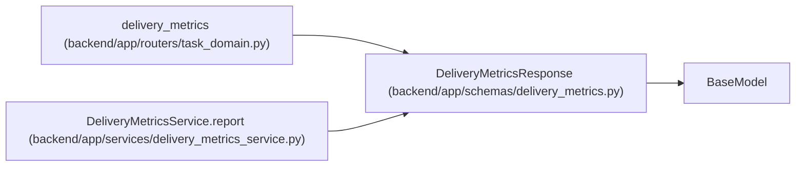

# DeliveryMetricsResponse

**Location:** `backend/app/schemas/delivery_metrics.py:23`
**Kind:** Pydantic model
**Bases:** `BaseModel`
**Module:** [delivery_metrics](../modules/delivery_metrics.md)

## Description

_Auto-generated from `DeliveryMetricsResponse` in `backend/app/schemas/delivery_metrics.py`._

## Attributes

| Name | Type | Wire name | Required | Nullable | Default | Constraints | Examples | Description |
|------|------|-----------|----------|----------|---------|-------------|-------------|----------|
| `contract_version` | `int` | `contract_version` | No | No | `1` | — | — | — |
| `window_start` | `datetime` | `window_start` | Yes | No | — | — | — | — |
| `window_end` | `datetime` | `window_end` | Yes | No | — | — | — | — |
| `scope_basis` | `str` | `scope_basis` | No | No | `'scope_at_observation'` | — | — | — |
| `accepted_leaf_tasks` | `int` | `accepted_leaf_tasks` | No | No | `0` | — | — | — |
| `acceptance_events` | `int` | `acceptance_events` | No | No | `0` | — | — | — |
| `rejection_events` | `int` | `rejection_events` | No | No | `0` | — | — | — |
| `canceled_leaf_tasks` | `int` | `canceled_leaf_tasks` | No | No | `0` | — | — | — |
| `reopened_events` | `int` | `reopened_events` | No | No | `0` | — | — | — |
| `lead_time` | `DurationSamples` | `lead_time` | Yes | No | — | — | — | — |
| `cycle_time` | `DurationSamples` | `cycle_time` | Yes | No | — | — | — | — |
| `review_delay` | `DurationSamples` | `review_delay` | Yes | No | — | — | — | — |
| `coverage` | `dict[str, int \| str]` | `coverage` | No | No | factory: `dict` | — | — | — |
| `review_queue` | `list[DeliveryQueueItem]` | `review_queue` | No | No | factory: `list` | — | — | — |
| `recovery_queue` | `list[DeliveryQueueItem]` | `recovery_queue` | No | No | factory: `list` | — | — | — |
| `queues_truncated` | `bool` | `queues_truncated` | No | No | `False` | — | — | — |

## Methods

*No public methods. Inherits from base classes.*

## Relationships

<!-- Auto-generated relationship summary. Do not edit by hand. -->

### Summary

| Module | Methods | Attributes |
|---|---:|---|
| [delivery_metrics](../modules/delivery_metrics.md) | 0 | `acceptance_events`, `accepted_leaf_tasks`, `canceled_leaf_tasks`, `contract_version`, `coverage`, `cycle_time`, `lead_time`, `queues_truncated`, `recovery_queue`, `rejection_events`, `reopened_events`, `review_delay` |

### Structure

| Kind | Entity | Module |
|---|---|---|
| Base | `BaseModel` | — |

### References

| Reference | Kind | Source | Call sites |
|---|---|---|---:|
| `delivery_metrics` | type_reference | [routers_task_domain](../modules/routers_task_domain.md) | — |
| `DeliveryMetricsService.report` | call | [delivery_metrics_service](../modules/delivery_metrics_service.md) | 1 |
