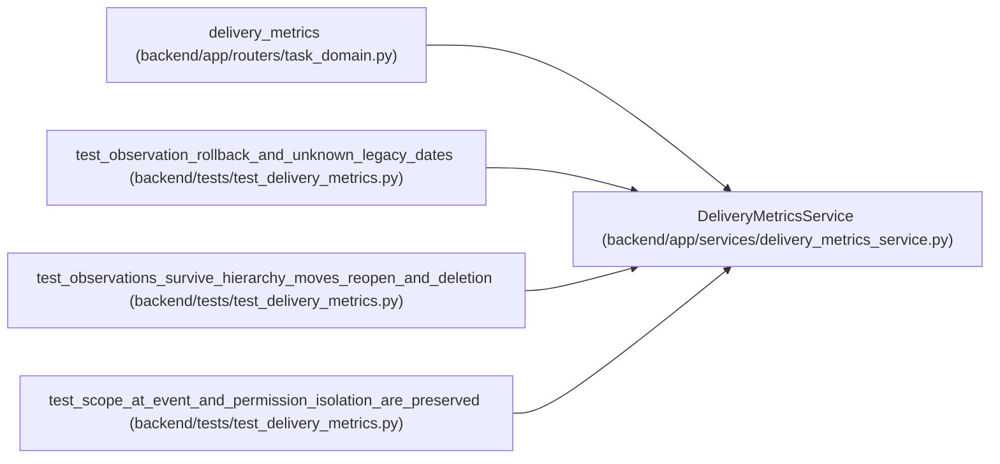

# DeliveryMetricsService

**Location:** `backend/app/services/delivery_metrics_service.py:100`
**Kind:** Class
**Bases:** —
**Module:** [delivery_metrics_service](../modules/delivery_metrics_service.md)

## Description

_Auto-generated from `DeliveryMetricsService` in `backend/app/services/delivery_metrics_service.py`._

## Attributes

*No annotated attributes found.*

## Methods

| Method | Signature | Decorators | Description |
|--------|-----------|------------|-------------|
| `__init__` | `(db)` | — | — |
| `report` | *(async)* `(*, project_id = None, iteration_id = None, lookback_days = 30, now = None)` | — | — |

## Relationships

<!-- Auto-generated relationship summary. Do not edit by hand. -->

### Summary

| Module | Methods | Attributes |
|---|---:|---|
| [delivery_metrics_service](../modules/delivery_metrics_service.md) | 2 | — |

### References

| Reference | Kind | Source | Call sites |
|---|---|---|---:|
| `delivery_metrics` | call | [routers_task_domain](../modules/routers_task_domain.md) | 1 |
| `test_observation_rollback_and_unknown_legacy_dates` | call | [test_delivery_metrics](../modules/test_delivery_metrics.md) | 1 |
| `test_observations_survive_hierarchy_moves_reopen_and_deletion` | call | [test_delivery_metrics](../modules/test_delivery_metrics.md) | 1 |
| `test_scope_at_event_and_permission_isolation_are_preserved` | call | [test_delivery_metrics](../modules/test_delivery_metrics.md) | 3 |
