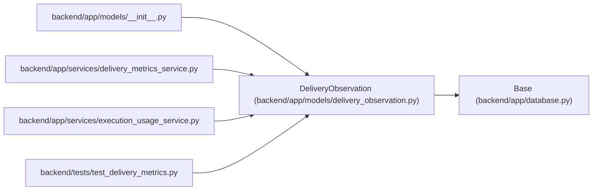

# DeliveryObservation

**Location:** `backend/app/models/delivery_observation.py:16`
**Kind:** Class
**Bases:** `Base`
**Module:** [delivery_observation](../modules/delivery_observation.md)

## Description

Retain delivery identity and scope independently of later hierarchy edits.

## Attributes

| Name | Type | Default | Description |
|------|------|---------|-------------|
| `id` | `Mapped[int]` | `mapped_column(Integer, primary_key=True)` | — |
| `original_task_id` | `Mapped[int]` | `mapped_column(Integer, nullable=False, index=True)` | — |
| `task_version` | `Mapped[int]` | `mapped_column(Integer, nullable=False)` | — |
| `project_id` | `Mapped[int \| None]` | `mapped_column(ForeignKey('projects.id', ondelete='SET NULL'))` | — |
| `iteration_id` | `Mapped[int \| None]` | `mapped_column(ForeignKey('iterations.id', ondelete='SET NULL'))` | — |
| `original_project_id` | `Mapped[int \| None]` | `mapped_column(Integer)` | — |
| `original_iteration_id` | `Mapped[int \| None]` | `mapped_column(Integer)` | — |
| `kind` | `Mapped[str]` | `mapped_column(String(32), nullable=False)` | — |
| `source` | `Mapped[str]` | `mapped_column(String(32), nullable=False)` | — |
| `observed_at` | `Mapped[datetime]` | `mapped_column(UTCDateTime(), nullable=False)` | — |

## Methods

*No public methods. Inherits from base classes.*

## Relationships

<!-- Auto-generated relationship summary. Do not edit by hand. -->

### Summary

| Module | Methods | Attributes |
|---|---:|---|
| [delivery_observation](../modules/delivery_observation.md) | 0 | `id`, `iteration_id`, `kind`, `observed_at`, `original_iteration_id`, `original_project_id`, `original_task_id`, `project_id`, `source`, `task_version` |

### Structure

| Kind | Entity | Module |
|---|---|---|
| Base | `Base` | [app_database](../modules/app_database.md) |

### References

| Reference | Kind | Source | Call sites |
|---|---|---|---:|
| `__init__` | import | [models___init__](../modules/models___init__.md) | — |
| `delivery_metrics_service` | import | [delivery_metrics_service](../modules/delivery_metrics_service.md) | — |
| `execution_usage_service` | import | [execution_usage_service](../modules/execution_usage_service.md) | — |
| `test_delivery_metrics` | import | [test_delivery_metrics](../modules/test_delivery_metrics.md) | — |
