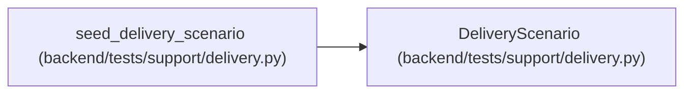

# DeliveryScenario

**Location:** `backend/tests/support/delivery.py:19`
**Kind:** Class
**Bases:** —
**Module:** [delivery](../modules/delivery.md)

**Decorators:** `@dataclass(frozen=True)`

## Description

_Auto-generated from `DeliveryScenario` in `backend/tests/support/delivery.py`._

## Attributes

| Name | Type | Default | Description |
|------|------|---------|-------------|
| `projects` | `tuple[int, int]` | *required* | — |
| `iterations` | `tuple[int, int]` | *required* | — |
| `profile` | `int` | *required* | — |
| `capacity_rows` | `tuple[int, int]` | *required* | — |
| `actors` | `tuple[int, int]` | *required* | — |
| `actor_keys` | `tuple[str, str]` | *required* | — |
| `sessions` | `tuple[int, int]` | *required* | — |
| `tasks` | `dict[str, int]` | *required* | — |

## Methods

*No public methods. Inherits from base classes.*

## Relationships

<!-- Auto-generated relationship summary. Do not edit by hand. -->

### Summary

| Module | Methods | Attributes |
|---|---:|---|
| [delivery](../modules/delivery.md) | 0 | `actor_keys`, `actors`, `capacity_rows`, `iterations`, `profile`, `projects`, `sessions`, `tasks` |

### References

| Reference | Kind | Source | Call sites |
|---|---|---|---:|
| `seed_delivery_scenario` | call | [delivery](../modules/delivery.md) | 1 |
| `seed_delivery_scenario` | type_reference | [delivery](../modules/delivery.md) | — |
