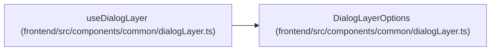

# DialogLayerOptions

**Location:** `frontend/src/components/common/dialogLayer.ts:57`
**Kind:** Class
**Bases:** —
**Module:** [dialogLayer](../modules/dialogLayer.md)

## Description

_Auto-generated from `DialogLayerOptions` in `frontend/src/components/common/dialogLayer.ts`._

## Attributes

| Name | Type | Required | Default | Description |
|------|------|----------|---------|-------------|
| `open` | `boolean` | Yes | — | — |
| `onClose` | `() => void` | Yes | — | — |
| `initialFocusRef` | `RefObject<HTMLElement \| null>` | No | — | — |
| `restoreFocusRef` | `RefObject<HTMLElement \| null>` | No | — | — |
| `closeDisabled` | `boolean` | No | — | — |

## Methods

*No public methods. Inherits from base classes.*

## Relationships

<!-- Auto-generated relationship summary. Do not edit by hand. -->

### Summary

| Module | Methods | Attributes |
|---|---:|---|
| [dialogLayer](../modules/dialogLayer.md) | 0 | `closeDisabled`, `initialFocusRef`, `onClose`, `open`, `restoreFocusRef` |

### References

| Reference | Kind | Source | Call sites |
|---|---|---|---:|
| `useDialogLayer` | type_reference | [dialogLayer](../modules/dialogLayer.md) | — |
