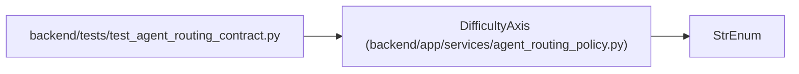

# DifficultyAxis

**Location:** `backend/app/services/agent_routing_policy.py:133`
**Kind:** Enum
**Bases:** `StrEnum`
**Module:** [agent_routing_policy](../modules/agent_routing_policy.md)

## Description

The five governed task-difficulty axes.

## Attributes

| Name | Declared value | Description |
|------|-------|-------------|
| `REASONING` | `'reasoning'` | — |
| `AMBIGUITY` | `'ambiguity'` | — |
| `CONTEXT_BREADTH` | `'context_breadth'` | — |
| `RISK` | `'risk'` | — |
| `VERIFICATION_BURDEN` | `'verification_burden'` | — |

## Methods

*No public methods. Inherits from base classes.*

## Relationships

<!-- Auto-generated relationship summary. Do not edit by hand. -->

### Summary

| Module | Methods | Attributes |
|---|---:|---|
| [agent_routing_policy](../modules/agent_routing_policy.md) | 0 | `AMBIGUITY`, `CONTEXT_BREADTH`, `REASONING`, `RISK`, `VERIFICATION_BURDEN` |

### Structure

| Kind | Entity | Module |
|---|---|---|
| Base | `StrEnum` | — |

### References

| Reference | Kind | Source | Call sites |
|---|---|---|---:|
| `test_agent_routing_contract` | import | [test_agent_routing_contract](../modules/test_agent_routing_contract.md) | — |
