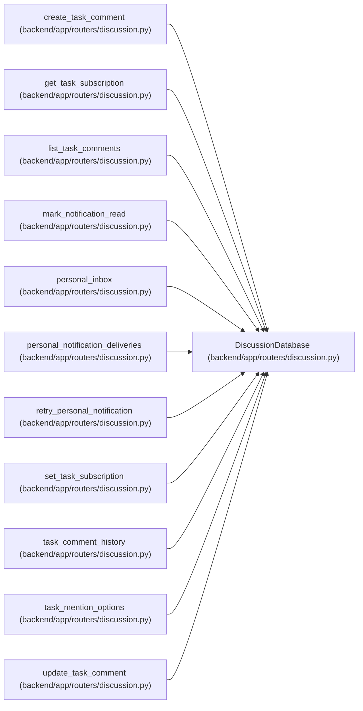

# DiscussionDatabase

**Location:** `backend/app/routers/discussion.py:14`
**Kind:** Type alias
**Bases:** —
**Module:** [routers_discussion](../modules/routers_discussion.md)
**Target:** `Annotated[AsyncSession, Depends(get_db, scope='function')]`

## Description

_Auto-generated from `DiscussionDatabase` in `backend/app/routers/discussion.py`._

## Attributes

*No annotated attributes found.*

## Methods

*No public methods. Inherits from base classes.*

## Relationships

<!-- Auto-generated relationship summary. Do not edit by hand. -->

### Summary

| Module | Methods | Attributes |
|---|---:|---|
| [routers_discussion](../modules/routers_discussion.md) | 0 | — |

### References

| Reference | Kind | Source | Call sites |
|---|---|---|---:|
| `create_task_comment` | type_reference | [routers_discussion](../modules/routers_discussion.md) | — |
| `get_task_subscription` | type_reference | [routers_discussion](../modules/routers_discussion.md) | — |
| `list_task_comments` | type_reference | [routers_discussion](../modules/routers_discussion.md) | — |
| `mark_notification_read` | type_reference | [routers_discussion](../modules/routers_discussion.md) | — |
| `personal_inbox` | type_reference | [routers_discussion](../modules/routers_discussion.md) | — |
| `personal_notification_deliveries` | type_reference | [routers_discussion](../modules/routers_discussion.md) | — |
| `retry_personal_notification` | type_reference | [routers_discussion](../modules/routers_discussion.md) | — |
| `set_task_subscription` | type_reference | [routers_discussion](../modules/routers_discussion.md) | — |
| `task_comment_history` | type_reference | [routers_discussion](../modules/routers_discussion.md) | — |
| `task_mention_options` | type_reference | [routers_discussion](../modules/routers_discussion.md) | — |
| `update_task_comment` | type_reference | [routers_discussion](../modules/routers_discussion.md) | — |
