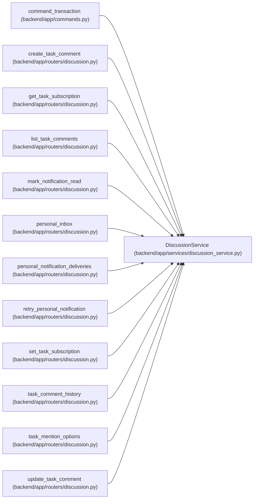

# DiscussionService

**Location:** `backend/app/services/discussion_service.py:19`
**Kind:** Class
**Bases:** —
**Module:** [discussion_service](../modules/discussion_service.md)

## Description

Human discussion and personal notification boundary. It validates mentions, protects comment versions/history and rechecks both source task scope and recipient eligibility at their respective write boundaries.

## Attributes

*No annotated attributes found.*

## Methods

| Method | Signature | Decorators | Description |
|--------|-----------|------------|-------------|
| `__init__` | `(db)` | — | — |
| `principal_id` | `()` | — | — |
| `task` | *(async)* `(task_id, *, writing = False, lock = False)` | — | — |
| `mention_options` | *(async)* `(task_id, *, query = '', limit = 25, after_id = 0)` | — | — |
| `recipient_authorized` | *(async)* `(principal_id, task_id)` | — | — |
| `serialize` | `(comment, author_name)` | `@staticmethod` | — |
| `list` | *(async)* `(task_id, *, after_id = 0, limit = 50)` | — | — |
| `history` | *(async)* `(task_id, comment_id, *, after_version = 0, limit = 50)` | — | — |
| `save` | *(async)* `(task_id, body, mentions, *, comment_id = None, expected_version = None, deleted = False)` | `@atomic_command` | — |
| `subscription` | *(async)* `(task_id)` | — | — |
| `subscribe` | *(async)* `(task_id, enabled, events, expected_version)` | `@atomic_command` | — |
| `enqueue` | *(async)* `(task_id, kind, key, *, mentions = ())` | — | Write worker intents only; dispatch rechecks access, preferences and task existence. |
| `deliver` | *(async)* `(delivery)` | — | Idempotent local inbox sink; no external recipient messaging occurs here. |
| `inbox` | *(async)* `(*, after_id = 0, limit = 50)` | — | — |
| `mark_read` | *(async)* `(notification_id, read)` | `@atomic_command` | — |
| `delivery_status` | *(async)* `(*, after_id = 0, limit = 50)` | — | — |
| `retry` | *(async)* `(delivery_id)` | `@atomic_command` | — |

## Relationships

<!-- Auto-generated relationship summary. Do not edit by hand. -->

### Summary

| Module | Methods | Attributes |
|---|---:|---|
| [discussion_service](../modules/discussion_service.md) | 17 | — |

### References

| Reference | Kind | Source | Call sites |
|---|---|---|---:|
| `command_transaction` | call | [commands](../modules/commands.md) | 1 |
| `create_task_comment` | call | [routers_discussion](../modules/routers_discussion.md) | 1 |
| `get_task_subscription` | call | [routers_discussion](../modules/routers_discussion.md) | 1 |
| `list_task_comments` | call | [routers_discussion](../modules/routers_discussion.md) | 1 |
| `mark_notification_read` | call | [routers_discussion](../modules/routers_discussion.md) | 1 |
| `personal_inbox` | call | [routers_discussion](../modules/routers_discussion.md) | 1 |
| `personal_notification_deliveries` | call | [routers_discussion](../modules/routers_discussion.md) | 1 |
| `retry_personal_notification` | call | [routers_discussion](../modules/routers_discussion.md) | 1 |
| `set_task_subscription` | call | [routers_discussion](../modules/routers_discussion.md) | 1 |
| `task_comment_history` | call | [routers_discussion](../modules/routers_discussion.md) | 1 |
| `task_mention_options` | call | [routers_discussion](../modules/routers_discussion.md) | 1 |
| `update_task_comment` | call | [routers_discussion](../modules/routers_discussion.md) | 1 |

> References: showing 12 of 20 logical references; 8 omitted by the 12-row generated summary limit.
