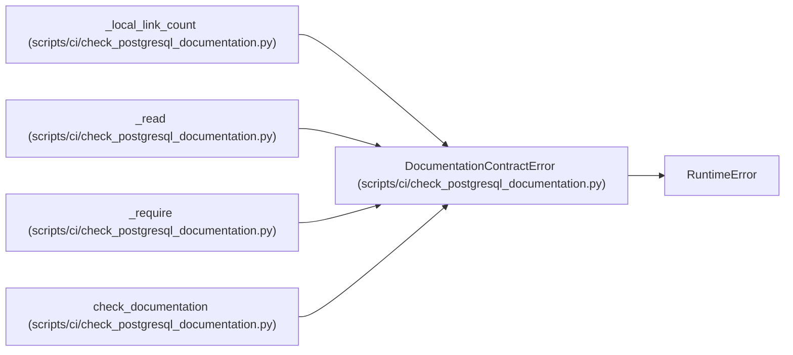

# DocumentationContractError

**Location:** `scripts/ci/check_postgresql_documentation.py:39`
**Kind:** Class
**Bases:** `RuntimeError`
**Module:** [check_postgresql_documentation](../modules/check_postgresql_documentation.md)

## Description

Raised when an operator-facing contract is incomplete or unsafe.

## Attributes

*No annotated attributes found.*

## Methods

*No public methods. Inherits from base classes.*

## Relationships

<!-- Auto-generated relationship summary. Do not edit by hand. -->

### Summary

| Module | Methods | Attributes |
|---|---:|---|
| [check_postgresql_documentation](../modules/check_postgresql_documentation.md) | 0 | — |

### Structure

| Kind | Entity | Module |
|---|---|---|
| Base | `RuntimeError` | — |

### References

| Reference | Kind | Source | Call sites |
|---|---|---|---:|
| `_local_link_count` | call | [check_postgresql_documentation](../modules/check_postgresql_documentation.md) | 1 |
| `_read` | call | [check_postgresql_documentation](../modules/check_postgresql_documentation.md) | 1 |
| `_require` | call | [check_postgresql_documentation](../modules/check_postgresql_documentation.md) | 1 |
| `check_documentation` | call | [check_postgresql_documentation](../modules/check_postgresql_documentation.md) | 3 |
