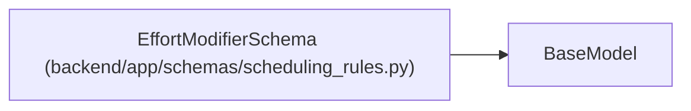

# EffortModifierSchema

**Location:** `backend/app/schemas/scheduling_rules.py:27`
**Kind:** Pydantic model
**Bases:** `BaseModel`
**Module:** [schemas_scheduling_rules](../modules/schemas_scheduling_rules.md)

## Description

An effort modifier rule.

## Attributes

| Name | Type | Wire name | Required | Nullable | Default | Constraints | Examples | Description |
|------|------|-----------|----------|----------|---------|-------------|-------------|----------|
| `id` | `str` | `id` | Yes | No | — | min_length=1 | — | Unique identifier |
| `enabled` | `bool` | `enabled` | No | No | `True` | — | — | Whether this modifier is active |
| `formula` | `Optional[str]` | `formula` | No | Yes | `None` | — | — | Formula expression (e.g., 'effort / coefficient') |
| `operation` | `Optional[str]` | `operation` | No | Yes | `None` | pattern='^(ceil\|floor\|round)$' | — | Math operation |
| `fallback` | `str` | `fallback` | No | No | `'effort'` | — | — | Fallback expression if formula fails |
| `min_value` | `Optional[float]` | `min_value` | No | Yes | `None` | ge=0 | — | Minimum result value |

## Methods

*No public methods. Inherits from base classes.*

## Relationships

<!-- Auto-generated relationship summary. Do not edit by hand. -->

### Summary

| Module | Methods | Attributes |
|---|---:|---|
| [schemas_scheduling_rules](../modules/schemas_scheduling_rules.md) | 0 | `enabled`, `fallback`, `formula`, `id`, `min_value`, `operation` |

### Structure

| Kind | Entity | Module |
|---|---|---|
| Base | `BaseModel` | — |
