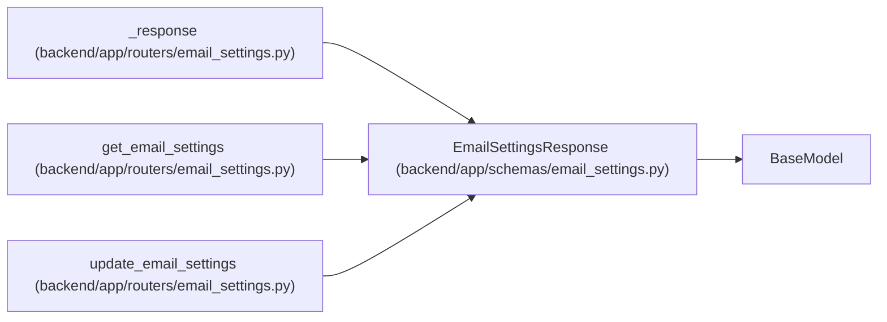

# EmailSettingsResponse

**Location:** `backend/app/schemas/email_settings.py:20`
**Kind:** Pydantic model
**Bases:** `BaseModel`
**Module:** [schemas_email_settings](../modules/schemas_email_settings.md)

## Description

Schema for email settings response (password masked).

## Attributes

| Name | Type | Wire name | Required | Nullable | Default | Constraints | Examples | Description |
|------|------|-----------|----------|----------|---------|-------------|-------------|----------|
| `enabled` | `bool` | `enabled` | Yes | No | — | — | — | — |
| `smtp_host` | `str` | `smtp_host` | Yes | No | — | — | — | — |
| `smtp_port` | `int` | `smtp_port` | Yes | No | — | — | — | — |
| `smtp_user` | `str` | `smtp_user` | Yes | No | — | — | — | — |
| `smtp_from_email` | `str` | `smtp_from_email` | Yes | No | — | — | — | — |
| `smtp_use_tls` | `bool` | `smtp_use_tls` | Yes | No | — | — | — | — |
| `has_password` | `bool` | `has_password` | Yes | No | — | — | — | — |
| `field_sources` | `dict[str, RuntimeSettingSource]` | `field_sources` | No | No | factory: `dict` | — | — | — |

## Methods

*No public methods. Inherits from base classes.*

## Relationships

<!-- Auto-generated relationship summary. Do not edit by hand. -->

### Summary

| Module | Methods | Attributes |
|---|---:|---|
| [schemas_email_settings](../modules/schemas_email_settings.md) | 0 | `enabled`, `field_sources`, `has_password`, `smtp_from_email`, `smtp_host`, `smtp_port`, `smtp_use_tls`, `smtp_user` |

### Structure

| Kind | Entity | Module |
|---|---|---|
| Base | `BaseModel` | — |

### References

| Reference | Kind | Source | Call sites |
|---|---|---|---:|
| `_response` | call | [routers_email_settings](../modules/routers_email_settings.md) | 1 |
| `_response` | type_reference | [routers_email_settings](../modules/routers_email_settings.md) | — |
| `get_email_settings` | type_reference | [routers_email_settings](../modules/routers_email_settings.md) | — |
| `update_email_settings` | type_reference | [routers_email_settings](../modules/routers_email_settings.md) | — |
