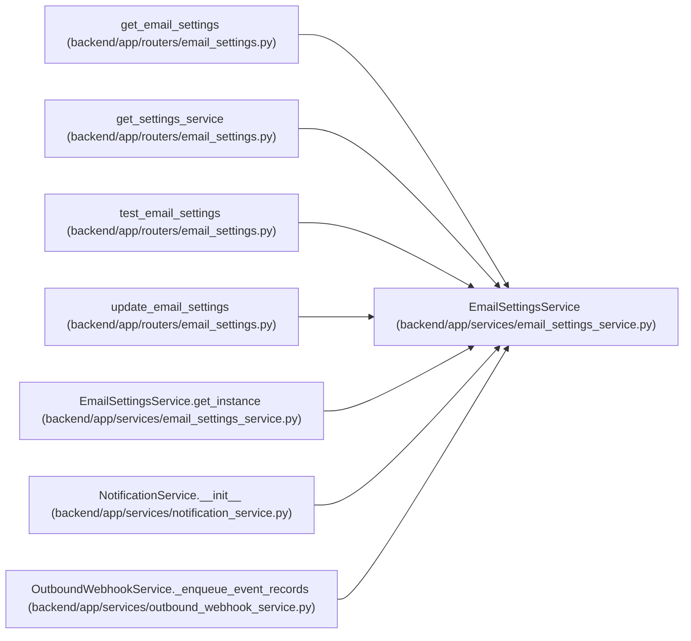

# EmailSettingsService

**Location:** `backend/app/services/email_settings_service.py:52`
**Kind:** Class
**Bases:** —
**Module:** [email_settings_service](../modules/email_settings_service.md)

## Description

Manage email settings through ``system_settings``.

## Attributes

*No annotated attributes found.*

## Methods

| Method | Signature | Decorators | Description |
|--------|-----------|------------|-------------|
| `__init__` | `(db: Optional[AsyncSession] = None, settings_override = None)` | — | — |
| `get_instance` | `() -> 'EmailSettingsService'` | `@classmethod` | Backward-compatible no-DB instance for legacy tests. |
| `get_settings_sync` | `(*, include_secret: bool = True) -> EmailSettings` | — | Return disabled settings when no DB session is available. |
| `_allow_private_egress` | `() -> bool` | — | — |
| `get_settings` | *(async)* `(*, include_secret: bool = False) -> EmailSettings` | — | Resolve current email settings. |
| `update_settings` | *(async)* `(*, enabled: bool, smtp_host: str, smtp_port: int, smtp_user: str, smtp_password: Optional[str], smtp_from_email: str, smtp_use_tls: bool, clear_smtp_password: bool = False) -> EmailSettings` | — | Update email settings. ``smtp_password=None`` preserves the current secret. |
| `test_connection` | *(async)* `(recipient: str) -> tuple[bool, str]` | — | Send a test email using current settings. |

## Relationships

<!-- Auto-generated relationship summary. Do not edit by hand. -->

### Summary

| Module | Methods | Attributes |
|---|---:|---|
| [email_settings_service](../modules/email_settings_service.md) | 7 | — |

### References

| Reference | Kind | Source | Call sites |
|---|---|---|---:|
| `get_email_settings` | type_reference | [routers_email_settings](../modules/routers_email_settings.md) | — |
| `get_settings_service` | call | [routers_email_settings](../modules/routers_email_settings.md) | 1 |
| `get_settings_service` | type_reference | [routers_email_settings](../modules/routers_email_settings.md) | — |
| `test_email_settings` | type_reference | [routers_email_settings](../modules/routers_email_settings.md) | — |
| `update_email_settings` | type_reference | [routers_email_settings](../modules/routers_email_settings.md) | — |
| `EmailSettingsService.get_instance` | call | [email_settings_service](../modules/email_settings_service.md) | 1 |
| `EmailSettingsService.get_instance` | type_reference | [email_settings_service](../modules/email_settings_service.md) | — |
| `NotificationService.__init__` | call | [notification_service](../modules/notification_service.md) | 1 |
| `OutboundWebhookService._enqueue_event_records` | call | [outbound_webhook_service](../modules/outbound_webhook_service.md) | 1 |
