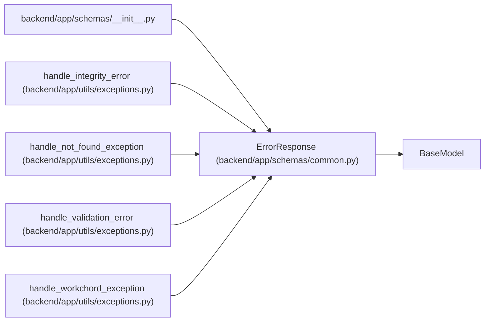

# ErrorResponse

**Location:** `backend/app/schemas/common.py:11`
**Kind:** Pydantic model
**Bases:** `BaseModel`
**Module:** [schemas_common](../modules/schemas_common.md)

## Description

Standard error response.

## Attributes

| Name | Type | Wire name | Required | Nullable | Default | Constraints | Examples | Description |
|------|------|-----------|----------|----------|---------|-------------|-------------|----------|
| `code` | `str` | `code` | Yes | No | — | — | — | — |
| `message` | `str` | `message` | Yes | No | — | — | — | — |
| `details` | `list[ErrorDetail]` | `details` | No | No | `[]` | — | — | — |

## Methods

*No public methods. Inherits from base classes.*

## Relationships

<!-- Auto-generated relationship summary. Do not edit by hand. -->

### Summary

| Module | Methods | Attributes |
|---|---:|---|
| [schemas_common](../modules/schemas_common.md) | 0 | `code`, `details`, `message` |

### Structure

| Kind | Entity | Module |
|---|---|---|
| Base | `BaseModel` | — |

### References

| Reference | Kind | Source | Call sites |
|---|---|---|---:|
| `__init__` | import | [schemas___init__](../modules/schemas___init__.md) | — |
| `handle_integrity_error` | call | [exceptions](../modules/exceptions.md) | 1 |
| `handle_not_found_exception` | call | [exceptions](../modules/exceptions.md) | 1 |
| `handle_validation_error` | call | [exceptions](../modules/exceptions.md) | 1 |
| `handle_workchord_exception` | call | [exceptions](../modules/exceptions.md) | 1 |
