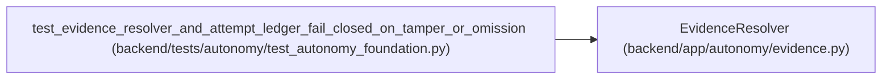

# EvidenceResolver

**Location:** `backend/app/autonomy/evidence.py:127`
**Kind:** Class
**Bases:** —
**Module:** [evidence](../modules/evidence.md)

## Description

Resolve immutable evidence and verify trust/provenance bindings.

## Attributes

*No annotated attributes found.*

## Methods

| Method | Signature | Decorators | Description |
|--------|-----------|------------|-------------|
| `__init__` | `(*, store: WormObjectStore, trust_resolver: PublicTrustResolver, clock: Callable[[], datetime] = lambda: datetime.now(UTC)) -> None` | — | — |
| `resolve` | `(object_digest: str, *, expected_release_fingerprint: str, expected_charter_digest: str, expected_contract_manifest_digest: str, expected_issuer_roles: set[str], expected_source_system: str, maximum_age: timedelta) -> SignedAutonomousEvidence` | — | — |
| `_resolve_linked_evidence` | `(object_digest: str, *, child: AutonomousEvidence) -> SignedAutonomousEvidence` | — | — |

## Relationships

<!-- Auto-generated relationship summary. Do not edit by hand. -->

### Summary

| Module | Methods | Attributes |
|---|---:|---|
| [evidence](../modules/evidence.md) | 3 | — |

### References

| Reference | Kind | Source | Call sites |
|---|---|---|---:|
| `test_evidence_resolver_and_attempt_ledger_fail_closed_on_tamper_or_omission` | call | [test_autonomy_foundation](../modules/test_autonomy_foundation.md) | 3 |
