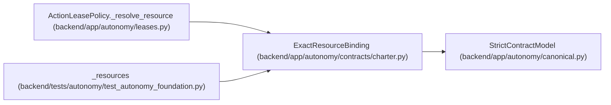

# ExactResourceBinding

**Location:** `backend/app/autonomy/contracts/charter.py:43`
**Kind:** Pydantic model
**Bases:** `StrictContractModel`
**Module:** [charter](../modules/charter.md)

## Description

One charter-pinned external system/resource generation.

## Validators

| Method | Scope | Fields | Mode | Options |
|--------|-------|--------|------|---------|
| `exact_operations` | field | allowed_operations | after | — |

## Attributes

| Name | Type | Wire name | Required | Nullable | Default | Constraints | Examples | Description |
|------|------|-----------|----------|----------|---------|-------------|-------------|----------|
| `logical_key` | `str` | `logical_key` | Yes | No | — | max_length=255; pattern=unknown (IDENTIFIER_PATTERN) | — | — |
| `system` | `Literal['source-database', 'target-database', 'git', 'ci', 'registry', 'deployment', 'scheduler', 'gateway', 'dns', 'identity', 'kms', 'worm', 'control-journal', 'observability', 'backup', 'clock', 'sanitizer']` | `system` | Yes | No | — | — | — | — |
| `resource_ref` | `str` | `resource_ref` | Yes | No | — | max_length=1024; pattern=unknown (OPAQUE_REF_PATTERN) | — | — |
| `generation` | `str` | `generation` | Yes | No | — | min_length=1; max_length=255 | — | — |
| `account_ref` | `str` | `account_ref` | Yes | No | — | max_length=1024; pattern=unknown (OPAQUE_REF_PATTERN) | — | — |
| `region` | `str` | `region` | Yes | No | — | min_length=1; max_length=128 | — | — |
| `allowed_operations` | `tuple[str, ...]` | `allowed_operations` | Yes | No | — | min_length=1; max_length=256 | — | — |
| `compatibility_rule` | `str \| None` | `compatibility_rule` | No | Yes | `None` | max_length=512 | — | — |

## Methods

| Method | Signature | Decorators | Description |
|--------|-----------|------------|-------------|
| `exact_operations` | `(value: tuple[str, ...]) -> tuple[str, ...]` | `@field_validator('allowed_operations')`, `@classmethod` | — |

## Relationships

<!-- Auto-generated relationship summary. Do not edit by hand. -->

### Summary

| Module | Methods | Attributes |
|---|---:|---|
| [charter](../modules/charter.md) | 1 | `account_ref`, `allowed_operations`, `compatibility_rule`, `generation`, `logical_key`, `region`, `resource_ref`, `system` |

### Structure

| Kind | Entity | Module |
|---|---|---|
| Base | `StrictContractModel` | [autonomy_canonical](../modules/autonomy_canonical.md) |

### References

| Reference | Kind | Source | Call sites |
|---|---|---|---:|
| `ActionLeasePolicy._resolve_resource` | type_reference | [leases](../modules/leases.md) | — |
| `_resources` | call | [test_autonomy_foundation](../modules/test_autonomy_foundation.md) | 1 |
| `_resources` | type_reference | [test_autonomy_foundation](../modules/test_autonomy_foundation.md) | — |
