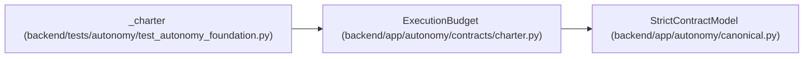

# ExecutionBudget

**Location:** `backend/app/autonomy/contracts/charter.py:96`
**Kind:** Pydantic model
**Bases:** `StrictContractModel`
**Module:** [charter](../modules/charter.md)

## Description

_Auto-generated from `ExecutionBudget` in `backend/app/autonomy/contracts/charter.py`._

## Attributes

| Name | Type | Wire name | Required | Nullable | Default | Constraints | Examples | Description |
|------|------|-----------|----------|----------|---------|-------------|-------------|----------|
| `maximum_spend_minor_units` | `int` | `maximum_spend_minor_units` | Yes | No | — | ge=0 | — | — |
| `currency` | `str` | `currency` | Yes | No | — | pattern='^[A-Z]{3}$' | — | — |
| `maximum_elapsed_seconds` | `int` | `maximum_elapsed_seconds` | Yes | No | — | ge=1; le=31536000 | — | — |
| `maximum_api_calls` | `int` | `maximum_api_calls` | Yes | No | — | ge=1; le=100000000 | — | — |
| `maximum_mutations` | `int` | `maximum_mutations` | Yes | No | — | ge=1; le=1000000 | — | — |
| `maximum_attempts_per_leaf` | `int` | `maximum_attempts_per_leaf` | Yes | No | — | ge=1; le=100 | — | — |

## Methods

*No public methods. Inherits from base classes.*

## Relationships

<!-- Auto-generated relationship summary. Do not edit by hand. -->

### Summary

| Module | Methods | Attributes |
|---|---:|---|
| [charter](../modules/charter.md) | 0 | `currency`, `maximum_api_calls`, `maximum_attempts_per_leaf`, `maximum_elapsed_seconds`, `maximum_mutations`, `maximum_spend_minor_units` |

### Structure

| Kind | Entity | Module |
|---|---|---|
| Base | `StrictContractModel` | [autonomy_canonical](../modules/autonomy_canonical.md) |

### References

| Reference | Kind | Source | Call sites |
|---|---|---|---:|
| `_charter` | call | [test_autonomy_foundation](../modules/test_autonomy_foundation.md) | 1 |
