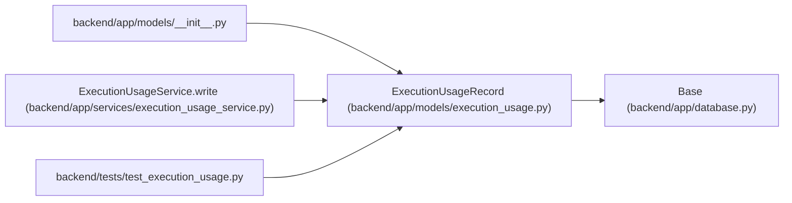

# ExecutionUsageRecord

**Location:** `backend/app/models/execution_usage.py:11`
**Kind:** Class
**Bases:** `Base`
**Module:** [models_execution_usage](../modules/models_execution_usage.md)

## Description

_Auto-generated from `ExecutionUsageRecord` in `backend/app/models/execution_usage.py`._

## Attributes

| Name | Type | Default | Description |
|------|------|---------|-------------|
| `id` | `Mapped[int]` | `mapped_column(Integer, primary_key=True)` | — |
| `run_id` | `Mapped[int \| None]` | `mapped_column(ForeignKey('agent_runs.id', ondelete='SET NULL'), index=True)` | — |
| `original_run_id` | `Mapped[int]` | `mapped_column(Integer, nullable=False, index=True)` | — |
| `run_identity` | `Mapped[str]` | `mapped_column(String(64), nullable=False)` | — |
| `original_task_id` | `Mapped[int]` | `mapped_column(Integer, nullable=False, index=True)` | — |
| `project_id` | `Mapped[int \| None]` | `mapped_column(ForeignKey('projects.id', ondelete='SET NULL'))` | — |
| `iteration_id` | `Mapped[int \| None]` | `mapped_column(ForeignKey('iterations.id', ondelete='SET NULL'))` | — |
| `original_project_id` | `Mapped[int \| None]` | `mapped_column(Integer)` | — |
| `original_iteration_id` | `Mapped[int \| None]` | `mapped_column(Integer)` | — |
| `reporter_actor_id` | `Mapped[int \| None]` | `mapped_column(ForeignKey('agent_actors.id', ondelete='SET NULL'))` | — |
| `report_id` | `Mapped[str]` | `mapped_column(String(128), nullable=False)` | — |
| `sequence` | `Mapped[int]` | `mapped_column(Integer, nullable=False)` | — |
| `digest` | `Mapped[str]` | `mapped_column(String(64), nullable=False)` | — |
| `previous_digest` | `Mapped[str \| None]` | `mapped_column(String(64))` | — |
| `payload` | `Mapped[dict]` | `mapped_column(JSON, nullable=False)` | — |
| `reported_at` | `Mapped[datetime]` | `mapped_column(UTCDateTime(), default=utc_now, nullable=False)` | — |

## Methods

*No public methods. Inherits from base classes.*

## Relationships

<!-- Auto-generated relationship summary. Do not edit by hand. -->

### Summary

| Module | Methods | Attributes |
|---|---:|---|
| [models_execution_usage](../modules/models_execution_usage.md) | 0 | `digest`, `id`, `iteration_id`, `original_iteration_id`, `original_project_id`, `original_run_id`, `original_task_id`, `payload`, `previous_digest`, `project_id`, `report_id`, `reported_at` |

### Structure

| Kind | Entity | Module |
|---|---|---|
| Base | `Base` | [app_database](../modules/app_database.md) |

### References

| Reference | Kind | Source | Call sites |
|---|---|---|---:|
| `__init__` | import | [models___init__](../modules/models___init__.md) | — |
| `ExecutionUsageService.write` | call | [execution_usage_service](../modules/execution_usage_service.md) | 1 |
| `test_execution_usage` | import | [test_execution_usage](../modules/test_execution_usage.md) | — |
