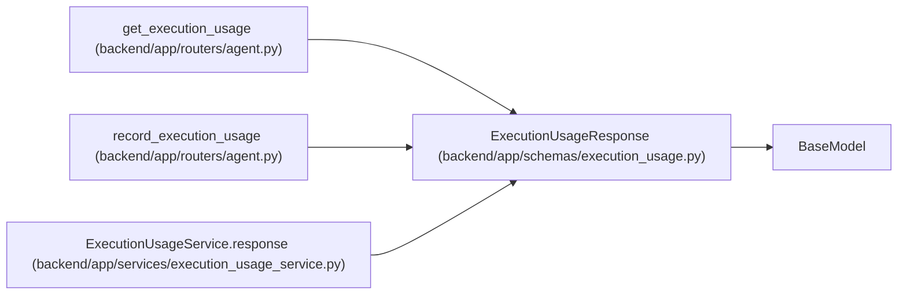

# ExecutionUsageResponse

**Location:** `backend/app/schemas/execution_usage.py:61`
**Kind:** Pydantic model
**Bases:** `BaseModel`
**Module:** [schemas_execution_usage](../modules/schemas_execution_usage.md)

## Description

_Auto-generated from `ExecutionUsageResponse` in `backend/app/schemas/execution_usage.py`._

## Attributes

| Name | Type | Wire name | Required | Nullable | Default | Constraints | Examples | Description |
|------|------|-----------|----------|----------|---------|-------------|-------------|----------|
| `id` | `int` | `id` | Yes | No | — | — | — | — |
| `original_run_id` | `int` | `original_run_id` | Yes | No | — | — | — | — |
| `original_task_id` | `int` | `original_task_id` | Yes | No | — | — | — | — |
| `sequence` | `int` | `sequence` | Yes | No | — | — | — | — |
| `digest` | `str` | `digest` | Yes | No | — | — | — | — |
| `previous_digest` | `str \| None` | `previous_digest` | Yes | Yes | — | — | — | — |
| `report` | `ExecutionUsageWrite` | `report` | Yes | No | — | — | — | — |
| `reported_at` | `datetime` | `reported_at` | Yes | No | — | — | — | — |
| `scope_basis` | `str` | `scope_basis` | No | No | `'scope_at_first_report'` | — | — | — |
| `independently_reconciled` | `Literal[False]` | `independently_reconciled` | No | No | `False` | — | — | — |

## Methods

*No public methods. Inherits from base classes.*

## Relationships

<!-- Auto-generated relationship summary. Do not edit by hand. -->

### Summary

| Module | Methods | Attributes |
|---|---:|---|
| [schemas_execution_usage](../modules/schemas_execution_usage.md) | 0 | `digest`, `id`, `independently_reconciled`, `original_run_id`, `original_task_id`, `previous_digest`, `report`, `reported_at`, `scope_basis`, `sequence` |

### Structure

| Kind | Entity | Module |
|---|---|---|
| Base | `BaseModel` | — |

### References

| Reference | Kind | Source | Call sites |
|---|---|---|---:|
| `get_execution_usage` | type_reference | [routers_agent](../modules/routers_agent.md) | — |
| `record_execution_usage` | type_reference | [routers_agent](../modules/routers_agent.md) | — |
| `ExecutionUsageService.response` | call | [execution_usage_service](../modules/execution_usage_service.md) | 1 |
