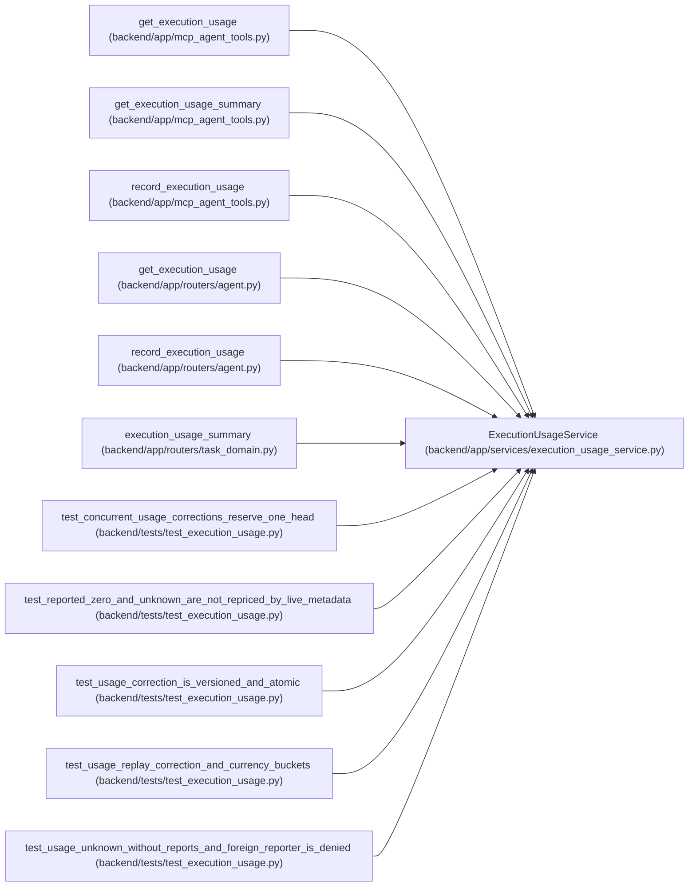

# ExecutionUsageService

**Location:** `backend/app/services/execution_usage_service.py:50`
**Kind:** Class
**Bases:** —
**Module:** [execution_usage_service](../modules/execution_usage_service.md)

## Description

_Auto-generated from `ExecutionUsageService` in `backend/app/services/execution_usage_service.py`._

## Attributes

*No annotated attributes found.*

## Methods

| Method | Signature | Decorators | Description |
|--------|-----------|------------|-------------|
| `__init__` | `(db)` | — | — |
| `response` | `(row)` | `@staticmethod` | — |
| `_run` | *(async)* `(actor, run_id, *, writing = False)` | — | — |
| `_scope` | `(row)` | — | — |
| `_history` | *(async)* `(identity)` | — | — |
| `latest` | *(async)* `(actor, run_id)` | — | — |
| `write` | *(async)* `(actor, run_id, data: ExecutionUsageWrite)` | `@atomic_command` | — |
| `summary` | *(async)* `(*, project_id = None, iteration_id = None, lookback_days = 30, budget_amount = None, budget_currency = None)` | — | — |

## Relationships

<!-- Auto-generated relationship summary. Do not edit by hand. -->

### Summary

| Module | Methods | Attributes |
|---|---:|---|
| [execution_usage_service](../modules/execution_usage_service.md) | 8 | — |

### References

| Reference | Kind | Source | Call sites |
|---|---|---|---:|
| `get_execution_usage` | call | [mcp_agent_tools](../modules/mcp_agent_tools.md) | 1 |
| `get_execution_usage_summary` | call | [mcp_agent_tools](../modules/mcp_agent_tools.md) | 1 |
| `record_execution_usage` | call | [mcp_agent_tools](../modules/mcp_agent_tools.md) | 1 |
| `get_execution_usage` | call | [routers_agent](../modules/routers_agent.md) | 1 |
| `record_execution_usage` | call | [routers_agent](../modules/routers_agent.md) | 1 |
| `execution_usage_summary` | call | [routers_task_domain](../modules/routers_task_domain.md) | 1 |
| `test_concurrent_usage_corrections_reserve_one_head` | call | [test_execution_usage](../modules/test_execution_usage.md) | 1 |
| `test_reported_zero_and_unknown_are_not_repriced_by_live_metadata` | call | [test_execution_usage](../modules/test_execution_usage.md) | 2 |
| `test_usage_correction_is_versioned_and_atomic` | call | [test_execution_usage](../modules/test_execution_usage.md) | 3 |
| `test_usage_replay_correction_and_currency_buckets` | call | [test_execution_usage](../modules/test_execution_usage.md) | 1 |
| `test_usage_unknown_without_reports_and_foreign_reporter_is_denied` | call | [test_execution_usage](../modules/test_execution_usage.md) | 1 |
