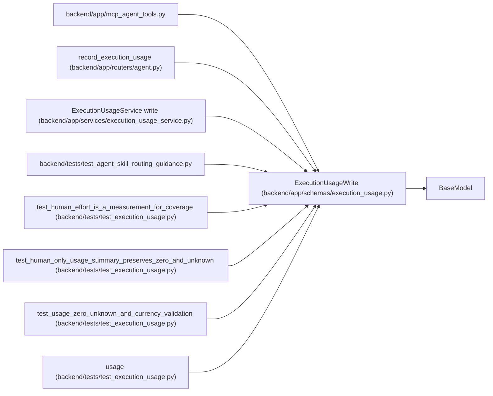

# ExecutionUsageWrite

**Location:** `backend/app/schemas/execution_usage.py:24`
**Kind:** Pydantic model
**Bases:** `BaseModel`
**Module:** [schemas_execution_usage](../modules/schemas_execution_usage.md)

## Description

_Auto-generated from `ExecutionUsageWrite` in `backend/app/schemas/execution_usage.py`._

## Model Configuration

| Setting | Value | Source |
|---------|-------|--------|
| `extra` | `'forbid'` | model_config |

## Validators

| Method | Scope | Fields | Mode | Options |
|--------|-------|--------|------|---------|
| `validate_report` | model | — | after | — |

## Attributes

| Name | Type | Wire name | Required | Nullable | Default | Constraints | Examples | Description |
|------|------|-----------|----------|----------|---------|-------------|-------------|----------|
| `report_id` | `str` | `report_id` | Yes | No | — | min_length=1; max_length=128; pattern='^[a-zA-Z0-9_.:-]+$' | — | — |
| `expected_previous_digest` | `str \| None` | `expected_previous_digest` | No | Yes | `None` | pattern='^[a-f0-9]{64}$' | — | — |
| `source` | `str` | `source` | Yes | No | — | min_length=1; max_length=200 | — | — |
| `provenance` | `Literal['provider_reported', 'runtime_metered', 'manual_reported', 'simulated']` | `provenance` | Yes | No | — | — | — | — |
| `reporting_mode` | `Literal['attempt_total']` | `reporting_mode` | Yes | No | — | — | — | — |
| `interval_start` | `AwareDatetime` | `interval_start` | Yes | No | — | — | — | — |
| `interval_end` | `AwareDatetime` | `interval_end` | Yes | No | — | — | — | — |
| `coverage` | `Literal['complete', 'partial', 'unavailable']` | `coverage` | Yes | No | — | — | — | — |
| `quantities` | `dict[str, Quantity \| None]` | `quantities` | No | No | factory: `dict` | max_length=30 | — | — |
| `reported_cost` | `Money \| None` | `reported_cost` | No | Yes | `None` | — | — | — |
| `currency` | `str \| None` | `currency` | No | Yes | `None` | pattern='^[A-Z]{3}$' | — | — |
| `pricing_basis` | `UsagePricingBasis \| None` | `pricing_basis` | No | Yes | `None` | — | — | — |
| `reported_human_effort_minutes` | `Quantity \| None` | `reported_human_effort_minutes` | No | Yes | `None` | — | — | — |

## Methods

| Method | Signature | Decorators | Description |
|--------|-----------|------------|-------------|
| `validate_report` | `()` | `@model_validator(mode='after')` | — |

## Relationships

<!-- Auto-generated relationship summary. Do not edit by hand. -->

### Summary

| Module | Methods | Attributes |
|---|---:|---|
| [schemas_execution_usage](../modules/schemas_execution_usage.md) | 1 | `coverage`, `currency`, `expected_previous_digest`, `interval_end`, `interval_start`, `pricing_basis`, `provenance`, `quantities`, `report_id`, `reported_cost`, `reported_human_effort_minutes`, `reporting_mode` |

### Structure

| Kind | Entity | Module |
|---|---|---|
| Base | `BaseModel` | — |

### References

| Reference | Kind | Source | Call sites |
|---|---|---|---:|
| `mcp_agent_tools` | import | [mcp_agent_tools](../modules/mcp_agent_tools.md) | — |
| `record_execution_usage` | type_reference | [routers_agent](../modules/routers_agent.md) | — |
| `ExecutionUsageService.write` | type_reference | [execution_usage_service](../modules/execution_usage_service.md) | — |
| `test_agent_skill_routing_guidance` | import | [test_agent_skill_routing_guidance](../modules/test_agent_skill_routing_guidance.md) | — |
| `test_human_effort_is_a_measurement_for_coverage` | call | [test_execution_usage](../modules/test_execution_usage.md) | 3 |
| `test_human_only_usage_summary_preserves_zero_and_unknown` | call | [test_execution_usage](../modules/test_execution_usage.md) | 1 |
| `test_usage_zero_unknown_and_currency_validation` | call | [test_execution_usage](../modules/test_execution_usage.md) | 1 |
| `usage` | call | [test_execution_usage](../modules/test_execution_usage.md) | 1 |
