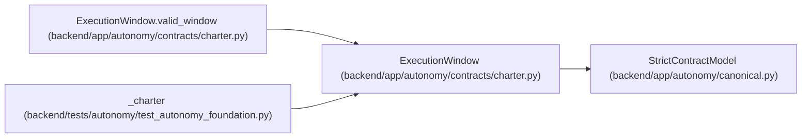

# ExecutionWindow

**Location:** `backend/app/autonomy/contracts/charter.py:129`
**Kind:** Pydantic model
**Bases:** `StrictContractModel`
**Module:** [charter](../modules/charter.md)

## Description

_Auto-generated from `ExecutionWindow` in `backend/app/autonomy/contracts/charter.py`._

## Validators

| Method | Scope | Fields | Mode | Options |
|--------|-------|--------|------|---------|
| `valid_window` | model | — | after | — |

## Attributes

| Name | Type | Wire name | Required | Nullable | Default | Constraints | Examples | Description |
|------|------|-----------|----------|----------|---------|-------------|-------------|----------|
| `logical_key` | `str` | `logical_key` | Yes | No | — | pattern=unknown (IDENTIFIER_PATTERN) | — | — |
| `starts_at` | `datetime` | `starts_at` | Yes | No | — | — | — | — |
| `ends_at` | `datetime` | `ends_at` | Yes | No | — | — | — | — |
| `permitted_stages` | `tuple[str, ...]` | `permitted_stages` | Yes | No | — | min_length=1; max_length=256 | — | — |

## Methods

| Method | Signature | Decorators | Description |
|--------|-----------|------------|-------------|
| `valid_window` | `() -> 'ExecutionWindow'` | `@model_validator(mode='after')` | — |

## Relationships

<!-- Auto-generated relationship summary. Do not edit by hand. -->

### Summary

| Module | Methods | Attributes |
|---|---:|---|
| [charter](../modules/charter.md) | 1 | `ends_at`, `logical_key`, `permitted_stages`, `starts_at` |

### Structure

| Kind | Entity | Module |
|---|---|---|
| Base | `StrictContractModel` | [autonomy_canonical](../modules/autonomy_canonical.md) |

### References

| Reference | Kind | Source | Call sites |
|---|---|---|---:|
| `ExecutionWindow.valid_window` | type_reference | [charter](../modules/charter.md) | — |
| `_charter` | call | [test_autonomy_foundation](../modules/test_autonomy_foundation.md) | 1 |
