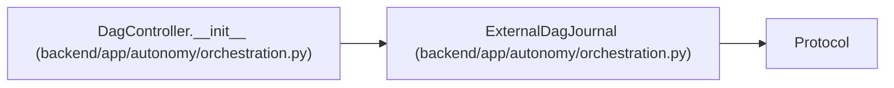

# ExternalDagJournal

**Location:** `backend/app/autonomy/orchestration.py:148`
**Kind:** Class
**Bases:** `Protocol`
**Module:** [orchestration](../modules/orchestration.md)

**Decorators:** `@runtime_checkable`

## Description

CAS state service deployed outside the WorkChord database/runtime.

## Attributes

*No annotated attributes found.*

## Methods

| Method | Signature | Decorators | Description |
|--------|-----------|------------|-------------|
| `read` | `(*, run_id: str) -> DagJournalSnapshot` | — | — |
| `compare_and_append` | `(*, run_id: str, expected_revision: int, expected_head_digest: str, entry: DagJournalEntry) -> bool` | — | — |

## Relationships

<!-- Auto-generated relationship summary. Do not edit by hand. -->

### Summary

| Module | Methods | Attributes |
|---|---:|---|
| [orchestration](../modules/orchestration.md) | 2 | — |

### Structure

| Kind | Entity | Module |
|---|---|---|
| Base | `Protocol` | — |

### References

| Reference | Kind | Source | Call sites |
|---|---|---|---:|
| `DagController.__init__` | type_reference | [orchestration](../modules/orchestration.md) | — |
