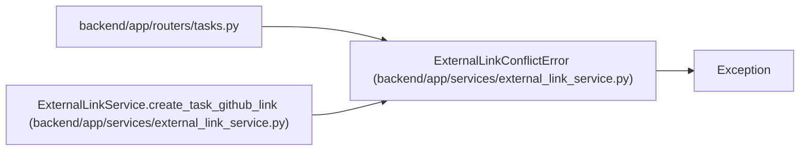

# ExternalLinkConflictError

**Location:** `backend/app/services/external_link_service.py:29`
**Kind:** Class
**Bases:** `Exception`
**Module:** [external_link_service](../modules/external_link_service.md)

## Description

Raised when a provider-specific link already exists for an entity.

## Attributes

*No annotated attributes found.*

## Methods

*No public methods. Inherits from base classes.*

## Relationships

<!-- Auto-generated relationship summary. Do not edit by hand. -->

### Summary

| Module | Methods | Attributes |
|---|---:|---|
| [external_link_service](../modules/external_link_service.md) | 0 | — |

### Structure

| Kind | Entity | Module |
|---|---|---|
| Base | `Exception` | — |

### References

| Reference | Kind | Source | Call sites |
|---|---|---|---:|
| `tasks` | import | [tasks](../modules/tasks.md) | — |
| `ExternalLinkService.create_task_github_link` | call | [external_link_service](../modules/external_link_service.md) | 1 |
