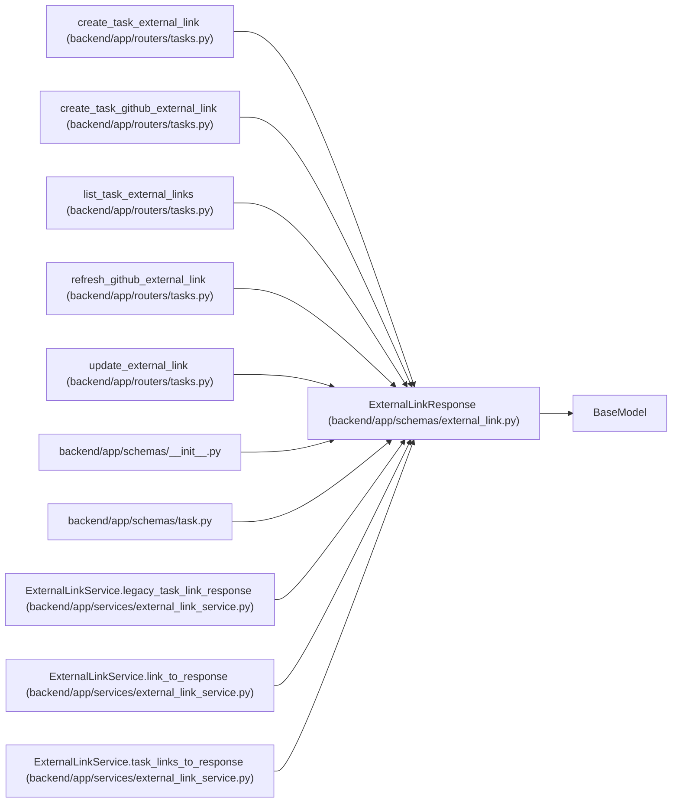

# ExternalLinkResponse

**Location:** `backend/app/schemas/external_link.py:116`
**Kind:** Pydantic model
**Bases:** `BaseModel`
**Module:** [schemas_external_link](../modules/schemas_external_link.md)

## Description

Schema for external link responses, including synthetic legacy links.

## Model Configuration

| Setting | Value | Source |
|---------|-------|--------|
| `from_attributes` | `True` | model_config |

## Attributes

| Name | Type | Wire name | Required | Nullable | Default | Constraints | Examples | Description |
|------|------|-----------|----------|----------|---------|-------------|-------------|----------|
| `id` | `Optional[int]` | `id` | No | Yes | `None` | — | — | — |
| `entity_type` | `str` | `entity_type` | Yes | No | — | — | — | — |
| `entity_id` | `int` | `entity_id` | Yes | No | — | — | — | — |
| `provider` | `str` | `provider` | Yes | No | — | — | — | — |
| `external_key` | `Optional[str]` | `external_key` | No | Yes | `None` | — | — | — |
| `url` | `Optional[str]` | `url` | No | Yes | `None` | — | — | — |
| `title` | `Optional[str]` | `title` | No | Yes | `None` | — | — | — |
| `status` | `Optional[str]` | `status` | No | Yes | `None` | — | — | — |
| `metadata_json` | `dict[str, Any]` | `metadata_json` | No | No | factory: `dict` | — | — | — |
| `is_legacy` | `bool` | `is_legacy` | No | No | `False` | — | — | — |
| `created_at` | `Optional[datetime]` | `created_at` | No | Yes | `None` | — | — | — |
| `updated_at` | `Optional[datetime]` | `updated_at` | No | Yes | `None` | — | — | — |

## Methods

*No public methods. Inherits from base classes.*

## Relationships

<!-- Auto-generated relationship summary. Do not edit by hand. -->

### Summary

| Module | Methods | Attributes |
|---|---:|---|
| [schemas_external_link](../modules/schemas_external_link.md) | 0 | `created_at`, `entity_id`, `entity_type`, `external_key`, `id`, `is_legacy`, `metadata_json`, `provider`, `status`, `title`, `updated_at`, `url` |

### Structure

| Kind | Entity | Module |
|---|---|---|
| Base | `BaseModel` | — |

### References

| Reference | Kind | Source | Call sites |
|---|---|---|---:|
| `create_task_external_link` | type_reference | [tasks](../modules/tasks.md) | — |
| `create_task_github_external_link` | type_reference | [tasks](../modules/tasks.md) | — |
| `list_task_external_links` | type_reference | [tasks](../modules/tasks.md) | — |
| `refresh_github_external_link` | type_reference | [tasks](../modules/tasks.md) | — |
| `update_external_link` | type_reference | [tasks](../modules/tasks.md) | — |
| `__init__` | import | [schemas___init__](../modules/schemas___init__.md) | — |
| `task` | import | [schemas_task](../modules/schemas_task.md) | — |
| `ExternalLinkService.legacy_task_link_response` | call | [external_link_service](../modules/external_link_service.md) | 1 |
| `ExternalLinkService.legacy_task_link_response` | type_reference | [external_link_service](../modules/external_link_service.md) | — |
| `ExternalLinkService.link_to_response` | call | [external_link_service](../modules/external_link_service.md) | 1 |
| `ExternalLinkService.link_to_response` | type_reference | [external_link_service](../modules/external_link_service.md) | — |
| `ExternalLinkService.task_links_to_response` | type_reference | [external_link_service](../modules/external_link_service.md) | — |
