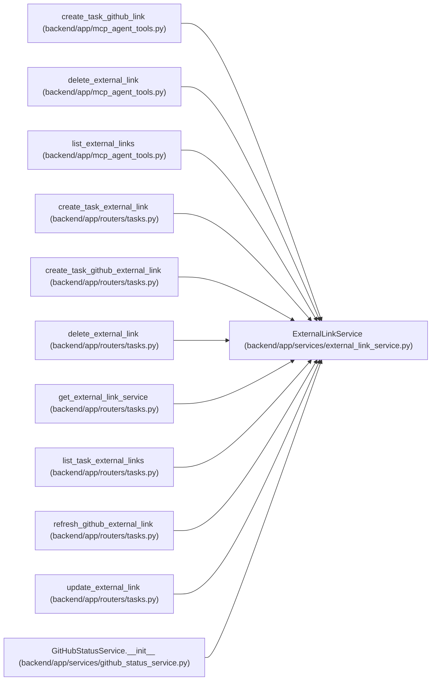

# ExternalLinkService

**Location:** `backend/app/services/external_link_service.py:61`
**Kind:** Class
**Bases:** —
**Module:** [external_link_service](../modules/external_link_service.md)

## Description

Service for generic external links and task-scoped link operations.

## Attributes

*No annotated attributes found.*

## Methods

| Method | Signature | Decorators | Description |
|--------|-----------|------------|-------------|
| `__init__` | `(db: AsyncSession)` | — | — |
| `_enum_value` | `(value)` | — | Normalize enum values before assigning to string columns. |
| `parse_github_url` | `(raw_url: str) -> ParsedGitHubLink` | — | Parse common GitHub PR, issue, and branch URLs. |
| `task_exists` | *(async)* `(task_id: int) -> bool` | — | Return whether a task exists. |
| `list_for_entity` | *(async)* `(entity_type: str, entity_id: int) -> Sequence[ExternalLink]` | — | List links for a generic entity. |
| `list_task_links` | *(async)* `(task_id: int) -> Optional[Sequence[ExternalLink]]` | — | List persisted external links for a task. |
| `get_by_id` | *(async)* `(link_id: int) -> Optional[ExternalLink]` | — | Get an external link by ID. |
| `create` | *(async)* `(data: ExternalLinkCreate, *, commit: bool = True) -> ExternalLink` | — | Create a generic external link. |
| `create_task_link` | *(async)* `(task_id: int, data: TaskExternalLinkCreate, *, commit: bool = True) -> Optional[ExternalLink]` | — | Create an external link for a task. |
| `github_link_exists` | *(async)* `(task_id: int, parsed: ParsedGitHubLink) -> bool` | — | Return whether the normalized GitHub link already exists for a task. |
| `create_task_github_link` | *(async)* `(task_id: int, url: str, *, commit: bool = True) -> Optional[ExternalLink]` | — | Parse and create a manual GitHub link for a task. |
| `update` | *(async)* `(link_id: int, data: ExternalLinkUpdate) -> Optional[ExternalLink]` | — | Apply a partial external link update. |
| `delete_link` | *(async)* `(link_id: int, *, commit: bool = True) -> bool` | — | Delete an external link by ID. |
| `delete_for_entity` | *(async)* `(entity_type: str, entity_id: int) -> None` | — | Delete all links for an entity. |
| `link_to_response` | `(link: ExternalLink) -> ExternalLinkResponse` | — | Convert a persisted link into a response schema. |
| `legacy_task_link_response` | `(task: Task) -> Optional[ExternalLinkResponse]` | — | Represent legacy task source fields as one read-only external link. |
| `task_links_to_response` | `(task: Task, persisted_links: Sequence[ExternalLink]) -> list[ExternalLinkResponse]` | — | Build task external link response list with legacy compatibility. |

## Relationships

<!-- Auto-generated relationship summary. Do not edit by hand. -->

### Summary

| Module | Methods | Attributes |
|---|---:|---|
| [external_link_service](../modules/external_link_service.md) | 17 | — |

### References

| Reference | Kind | Source | Call sites |
|---|---|---|---:|
| `create_task_github_link` | call | [mcp_agent_tools](../modules/mcp_agent_tools.md) | 1 |
| `delete_external_link` | call | [mcp_agent_tools](../modules/mcp_agent_tools.md) | 1 |
| `list_external_links` | call | [mcp_agent_tools](../modules/mcp_agent_tools.md) | 1 |
| `create_task_external_link` | type_reference | [tasks](../modules/tasks.md) | — |
| `create_task_github_external_link` | type_reference | [tasks](../modules/tasks.md) | — |
| `delete_external_link` | type_reference | [tasks](../modules/tasks.md) | — |
| `get_external_link_service` | call | [tasks](../modules/tasks.md) | 1 |
| `get_external_link_service` | type_reference | [tasks](../modules/tasks.md) | — |
| `list_task_external_links` | type_reference | [tasks](../modules/tasks.md) | — |
| `refresh_github_external_link` | type_reference | [tasks](../modules/tasks.md) | — |
| `update_external_link` | type_reference | [tasks](../modules/tasks.md) | — |
| `GitHubStatusService.__init__` | call | [github_status_service](../modules/github_status_service.md) | 1 |

> References: showing 12 of 14 logical references; 2 omitted by the 12-row generated summary limit.
