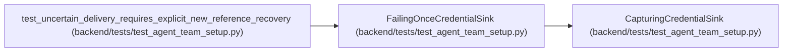

# FailingOnceCredentialSink

**Location:** `backend/tests/test_agent_team_setup.py:92`
**Kind:** Class
**Bases:** `CapturingCredentialSink`
**Module:** [test_agent_team_setup](../modules/test_agent_team_setup.md)

## Description

_Auto-generated from `FailingOnceCredentialSink` in `backend/tests/test_agent_team_setup.py`._

## Attributes

*No annotated attributes found.*

## Methods

| Method | Signature | Decorators | Description |
|--------|-----------|------------|-------------|
| `__init__` | `() -> None` | — | — |
| `deliver` | *(async)* `(*, credential_ref: str, actor_key: str, actor_name: str, api_key: str) -> str` | — | — |

## Relationships

<!-- Auto-generated relationship summary. Do not edit by hand. -->

### Summary

| Module | Methods | Attributes |
|---|---:|---|
| [test_agent_team_setup](../modules/test_agent_team_setup.md) | 2 | — |

### Structure

| Kind | Entity | Module |
|---|---|---|
| Base | `CapturingCredentialSink` | [test_agent_team_setup](../modules/test_agent_team_setup.md) |

### References

| Reference | Kind | Source | Call sites |
|---|---|---|---:|
| `test_uncertain_delivery_requires_explicit_new_reference_recovery` | call | [test_agent_team_setup](../modules/test_agent_team_setup.md) | 1 |
