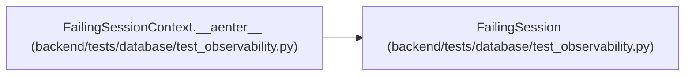

# FailingSession

**Location:** `backend/tests/database/test_observability.py:139`
**Kind:** Class
**Bases:** —
**Module:** [test_observability](../modules/test_observability.md)

## Description

_Auto-generated from `FailingSession` in `backend/tests/database/test_observability.py`._

## Attributes

*No annotated attributes found.*

## Methods

| Method | Signature | Decorators | Description |
|--------|-----------|------------|-------------|
| `execute` | *(async)* `(_statement: Any) -> None` | — | — |
| `rollback` | *(async)* `() -> None` | — | — |

## Relationships

<!-- Auto-generated relationship summary. Do not edit by hand. -->

### Summary

| Module | Methods | Attributes |
|---|---:|---|
| [test_observability](../modules/test_observability.md) | 2 | — |

### References

| Reference | Kind | Source | Call sites |
|---|---|---|---:|
| `FailingSessionContext.__aenter__` | call | [test_observability](../modules/test_observability.md) | 1 |
| `FailingSessionContext.__aenter__` | type_reference | [test_observability](../modules/test_observability.md) | — |
