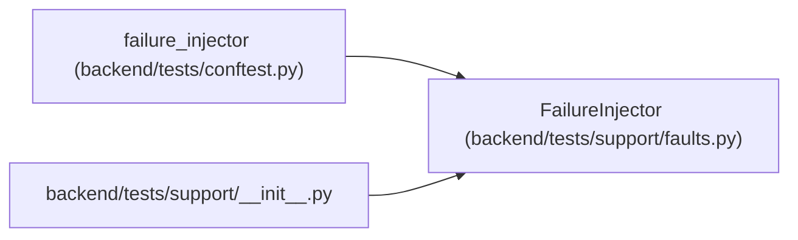

# FailureInjector

**Location:** `backend/tests/support/faults.py:26`
**Kind:** Class
**Bases:** —
**Module:** [faults](../modules/faults.md)

## Description

Raise an explicit queued failure at a named deterministic checkpoint.

## Attributes

*No annotated attributes found.*

## Methods

| Method | Signature | Decorators | Description |
|--------|-----------|------------|-------------|
| `__init__` | `() -> None` | — | — |
| `fail_next` | `(checkpoint: str, failure: BaseException) -> None` | — | — |
| `checkpoint` | `(checkpoint: str) -> None` | — | — |

## Relationships

<!-- Auto-generated relationship summary. Do not edit by hand. -->

### Summary

| Module | Methods | Attributes |
|---|---:|---|
| [faults](../modules/faults.md) | 3 | — |

### References

| Reference | Kind | Source | Call sites |
|---|---|---|---:|
| `failure_injector` | call | [conftest](../modules/conftest.md) | 1 |
| `__init__` | import | [support___init__](../modules/support___init__.md) | — |
