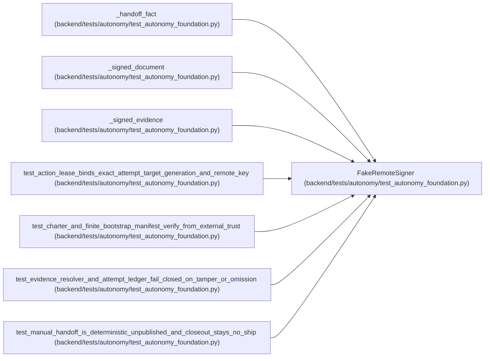

# FakeRemoteSigner

**Location:** `backend/tests/autonomy/test_autonomy_foundation.py:117`
**Kind:** Class
**Bases:** —
**Module:** [test_autonomy_foundation](../modules/test_autonomy_foundation.md)

## Description

_Auto-generated from `FakeRemoteSigner` in `backend/tests/autonomy/test_autonomy_foundation.py`._

## Attributes

*No annotated attributes found.*

## Methods

| Method | Signature | Decorators | Description |
|--------|-----------|------------|-------------|
| `__init__` | `() -> None` | — | — |
| `sign_digest` | `(*, payload_sha256: str, key_ref: str, subject: str) -> DetachedSignatureEnvelope` | — | — |
| `trust_anchor` | `(*subjects: str) -> PublicTrustAnchor` | — | — |

## Relationships

<!-- Auto-generated relationship summary. Do not edit by hand. -->

### Summary

| Module | Methods | Attributes |
|---|---:|---|
| [test_autonomy_foundation](../modules/test_autonomy_foundation.md) | 3 | — |

### References

| Reference | Kind | Source | Call sites |
|---|---|---|---:|
| `_handoff_fact` | type_reference | [test_autonomy_foundation](../modules/test_autonomy_foundation.md) | — |
| `_signed_document` | type_reference | [test_autonomy_foundation](../modules/test_autonomy_foundation.md) | — |
| `_signed_evidence` | type_reference | [test_autonomy_foundation](../modules/test_autonomy_foundation.md) | — |
| `test_action_lease_binds_exact_attempt_target_generation_and_remote_key` | call | [test_autonomy_foundation](../modules/test_autonomy_foundation.md) | 1 |
| `test_charter_and_finite_bootstrap_manifest_verify_from_external_trust` | call | [test_autonomy_foundation](../modules/test_autonomy_foundation.md) | 1 |
| `test_evidence_resolver_and_attempt_ledger_fail_closed_on_tamper_or_omission` | call | [test_autonomy_foundation](../modules/test_autonomy_foundation.md) | 1 |
| `test_manual_handoff_is_deterministic_unpublished_and_closeout_stays_no_ship` | call | [test_autonomy_foundation](../modules/test_autonomy_foundation.md) | 1 |
