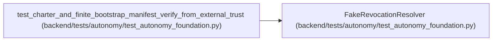

# FakeRevocationResolver

**Location:** `backend/tests/autonomy/test_autonomy_foundation.py:169`
**Kind:** Class
**Bases:** —
**Module:** [test_autonomy_foundation](../modules/test_autonomy_foundation.md)

## Description

_Auto-generated from `FakeRevocationResolver` in `backend/tests/autonomy/test_autonomy_foundation.py`._

## Attributes

*No annotated attributes found.*

## Methods

| Method | Signature | Decorators | Description |
|--------|-----------|------------|-------------|
| `resolve` | `(*, charter_id: str, source_ref: str) -> RevocationObservation` | — | — |

## Relationships

<!-- Auto-generated relationship summary. Do not edit by hand. -->

### Summary

| Module | Methods | Attributes |
|---|---:|---|
| [test_autonomy_foundation](../modules/test_autonomy_foundation.md) | 1 | — |

### References

| Reference | Kind | Source | Call sites |
|---|---|---|---:|
| `test_charter_and_finite_bootstrap_manifest_verify_from_external_trust` | call | [test_autonomy_foundation](../modules/test_autonomy_foundation.md) | 1 |
