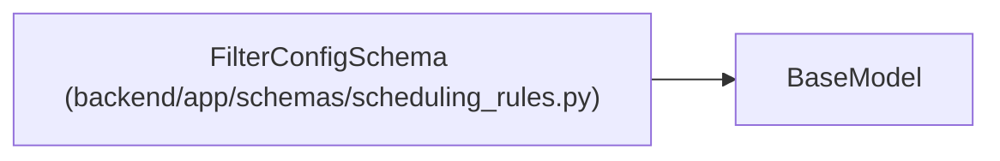

# FilterConfigSchema

**Location:** `backend/app/schemas/scheduling_rules.py:13`
**Kind:** Pydantic model
**Bases:** `BaseModel`
**Module:** [schemas_scheduling_rules](../modules/schemas_scheduling_rules.md)

## Description

Filter configuration with conditions.

## Attributes

| Name | Type | Wire name | Required | Nullable | Default | Constraints | Examples | Description |
|------|------|-----------|----------|----------|---------|-------------|-------------|----------|
| `all` | `list[str]` | `all` | No | No | factory: `list` | — | — | All conditions must match (AND) |

## Methods

*No public methods. Inherits from base classes.*

## Relationships

<!-- Auto-generated relationship summary. Do not edit by hand. -->

### Summary

| Module | Methods | Attributes |
|---|---:|---|
| [schemas_scheduling_rules](../modules/schemas_scheduling_rules.md) | 0 | `all` |

### Structure

| Kind | Entity | Module |
|---|---|---|
| Base | `BaseModel` | — |
