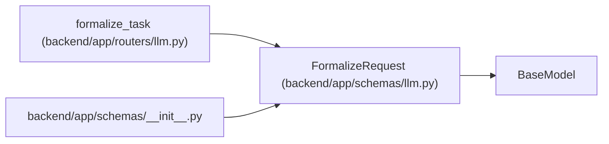

# FormalizeRequest

**Location:** `backend/app/schemas/llm.py:6`
**Kind:** Pydantic model
**Bases:** `BaseModel`
**Module:** [schemas_llm](../modules/schemas_llm.md)

## Description

Request for task formalization via LLM.

## Attributes

| Name | Type | Wire name | Required | Nullable | Default | Constraints | Examples | Description |
|------|------|-----------|----------|----------|---------|-------------|-------------|----------|
| `context` | `Optional[str]` | `context` | No | Yes | `None` | — | — | Optional project context |

## Methods

*No public methods. Inherits from base classes.*

## Relationships

<!-- Auto-generated relationship summary. Do not edit by hand. -->

### Summary

| Module | Methods | Attributes |
|---|---:|---|
| [schemas_llm](../modules/schemas_llm.md) | 0 | `context` |

### Structure

| Kind | Entity | Module |
|---|---|---|
| Base | `BaseModel` | — |

### References

| Reference | Kind | Source | Call sites |
|---|---|---|---:|
| `formalize_task` | type_reference | [routers_llm](../modules/routers_llm.md) | — |
| `__init__` | import | [schemas___init__](../modules/schemas___init__.md) | — |
