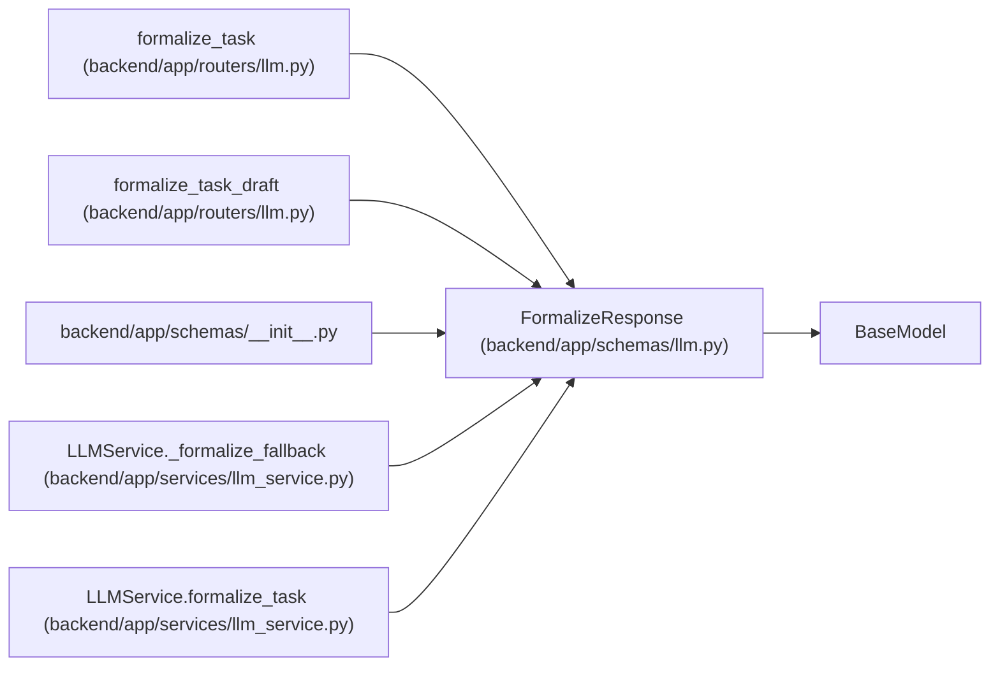

# FormalizeResponse

**Location:** `backend/app/schemas/llm.py:24`
**Kind:** Pydantic model
**Bases:** `BaseModel`
**Module:** [schemas_llm](../modules/schemas_llm.md)

## Description

Response from task formalization.

## Attributes

| Name | Type | Wire name | Required | Nullable | Default | Constraints | Examples | Description |
|------|------|-----------|----------|----------|---------|-------------|-------------|----------|
| `original_title` | `str` | `original_title` | Yes | No | — | — | — | — |
| `formalized_title` | `str` | `formalized_title` | Yes | No | — | — | — | — |
| `suggested_description` | `str` | `suggested_description` | Yes | No | — | — | — | — |
| `language` | `str` | `language` | No | No | `'en'` | — | — | — |
| `suggested_effort_days` | `Optional[float]` | `suggested_effort_days` | No | Yes | `None` | — | — | — |
| `suggested_subtasks` | `list[SuggestedSubtask]` | `suggested_subtasks` | No | No | factory: `list` | — | — | — |

## Methods

*No public methods. Inherits from base classes.*

## Relationships

<!-- Auto-generated relationship summary. Do not edit by hand. -->

### Summary

| Module | Methods | Attributes |
|---|---:|---|
| [schemas_llm](../modules/schemas_llm.md) | 0 | `formalized_title`, `language`, `original_title`, `suggested_description`, `suggested_effort_days`, `suggested_subtasks` |

### Structure

| Kind | Entity | Module |
|---|---|---|
| Base | `BaseModel` | — |

### References

| Reference | Kind | Source | Call sites |
|---|---|---|---:|
| `formalize_task` | type_reference | [routers_llm](../modules/routers_llm.md) | — |
| `formalize_task_draft` | type_reference | [routers_llm](../modules/routers_llm.md) | — |
| `__init__` | import | [schemas___init__](../modules/schemas___init__.md) | — |
| `LLMService._formalize_fallback` | call | [llm_service](../modules/llm_service.md) | 1 |
| `LLMService._formalize_fallback` | type_reference | [llm_service](../modules/llm_service.md) | — |
| `LLMService.formalize_task` | call | [llm_service](../modules/llm_service.md) | 1 |
| `LLMService.formalize_task` | type_reference | [llm_service](../modules/llm_service.md) | — |
