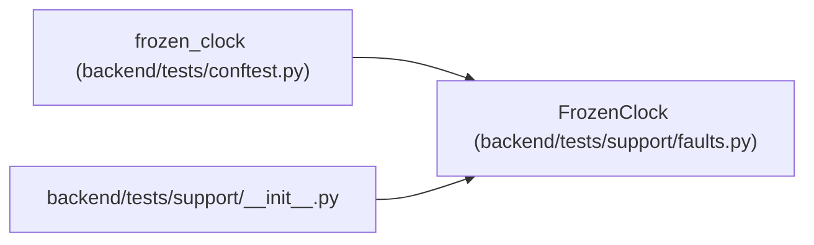

# FrozenClock

**Location:** `backend/tests/support/faults.py:11`
**Kind:** Class
**Bases:** —
**Module:** [faults](../modules/faults.md)

**Decorators:** `@dataclass`

## Description

A manually advanced UTC clock for lease and expiry tests.

## Attributes

| Name | Type | Default | Description |
|------|------|---------|-------------|
| `current` | `datetime` | `datetime(2026, 1, 1, tzinfo=UTC)` | — |

## Methods

| Method | Signature | Decorators | Description |
|--------|-----------|------------|-------------|
| `now` | `() -> datetime` | — | — |
| `advance` | `(delta: timedelta) -> datetime` | — | — |

## Relationships

<!-- Auto-generated relationship summary. Do not edit by hand. -->

### Summary

| Module | Methods | Attributes |
|---|---:|---|
| [faults](../modules/faults.md) | 2 | `current` |

### References

| Reference | Kind | Source | Call sites |
|---|---|---|---:|
| `frozen_clock` | call | [conftest](../modules/conftest.md) | 1 |
| `__init__` | import | [support___init__](../modules/support___init__.md) | — |
