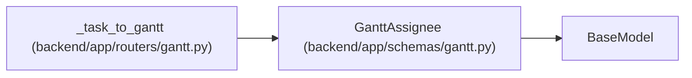

# GanttAssignee

**Location:** `backend/app/schemas/gantt.py:11`
**Kind:** Pydantic model
**Bases:** `BaseModel`
**Module:** [schemas_gantt](../modules/schemas_gantt.md)

## Description

Assignee info for Gantt task.

## Attributes

| Name | Type | Wire name | Required | Nullable | Default | Constraints | Examples | Description |
|------|------|-----------|----------|----------|---------|-------------|-------------|----------|
| `id` | `int` | `id` | Yes | No | — | — | — | — |
| `name` | `str` | `name` | Yes | No | — | — | — | — |

## Methods

*No public methods. Inherits from base classes.*

## Relationships

<!-- Auto-generated relationship summary. Do not edit by hand. -->

### Summary

| Module | Methods | Attributes |
|---|---:|---|
| [schemas_gantt](../modules/schemas_gantt.md) | 0 | `id`, `name` |

### Structure

| Kind | Entity | Module |
|---|---|---|
| Base | `BaseModel` | — |

### References

| Reference | Kind | Source | Call sites |
|---|---|---|---:|
| `_task_to_gantt` | call | [routers_gantt](../modules/routers_gantt.md) | 2 |
