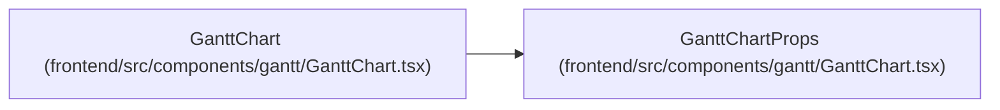

# GanttChartProps

**Location:** `frontend/src/components/gantt/GanttChart.tsx:22`
**Kind:** Class
**Bases:** —
**Module:** [GanttChart](../modules/GanttChart.md)

## Description

_Auto-generated from `GanttChartProps` in `frontend/src/components/gantt/GanttChart.tsx`._

## Attributes

| Name | Type | Required | Default | Description |
|------|------|----------|---------|-------------|
| `iterationId` | `number` | Yes | — | — |
| `iterationRevision` | `number` | No | — | — |
| `startDate` | `string` | Yes | — | — |
| `endDate` | `string` | Yes | — | — |
| `tasks` | `GanttTask[]` | Yes | — | — |
| `weekends` | `string[]` | Yes | — | — |
| `holidays` | `string[]` | Yes | — | — |
| `memberVacations` | `Record<number, string[]>` | Yes | — | — |
| `sandboxMode` | `boolean` | No | — | — |
| `onSaveSandbox` | `(taskId: number, updatedData: Partial<GanttTask>) => void` | No | — | — |

## Methods

*No public methods. Inherits from base classes.*

## Relationships

<!-- Auto-generated relationship summary. Do not edit by hand. -->

### Summary

| Module | Methods | Attributes |
|---|---:|---|
| [GanttChart](../modules/GanttChart.md) | 0 | `endDate`, `holidays`, `iterationId`, `iterationRevision`, `memberVacations`, `onSaveSandbox`, `sandboxMode`, `startDate`, `tasks`, `weekends` |

### References

| Reference | Kind | Source | Call sites |
|---|---|---|---:|
| `GanttChart` | type_reference | [GanttChart](../modules/GanttChart.md) | — |
