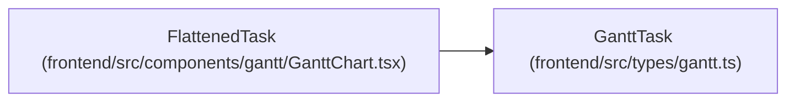

# FlattenedTask

**Location:** `frontend/src/components/gantt/GanttChart.tsx:35`
**Kind:** Class
**Bases:** `GanttTask`
**Module:** [GanttChart](../modules/GanttChart.md)

## Description

_Auto-generated from `FlattenedTask` in `frontend/src/components/gantt/GanttChart.tsx`._

## Attributes

| Name | Type | Required | Default | Description |
|------|------|----------|---------|-------------|
| `depth` | `number` | Yes | — | — |

## Methods

*No public methods. Inherits from base classes.*

## Relationships

<!-- Auto-generated relationship summary. Do not edit by hand. -->

### Summary

| Module | Methods | Attributes |
|---|---:|---|
| [GanttChart](../modules/GanttChart.md) | 0 | `depth` |

### Structure

| Kind | Entity | Module |
|---|---|---|
| Base | `GanttTask` | [types_gantt](../modules/types_gantt.md) |
