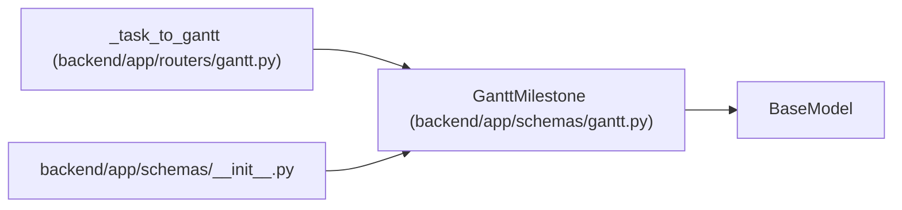

# GanttMilestone

**Location:** `backend/app/schemas/gantt.py:17`
**Kind:** Pydantic model
**Bases:** `BaseModel`
**Module:** [schemas_gantt](../modules/schemas_gantt.md)

## Description

Milestone info for Gantt task editing.

## Attributes

| Name | Type | Wire name | Required | Nullable | Default | Constraints | Examples | Description |
|------|------|-----------|----------|----------|---------|-------------|-------------|----------|
| `id` | `int` | `id` | Yes | No | — | — | — | — |
| `project_id` | `int` | `project_id` | Yes | No | — | — | — | — |
| `name` | `str` | `name` | Yes | No | — | — | — | — |
| `status` | `str` | `status` | Yes | No | — | — | — | — |
| `target_date` | `Optional[date]` | `target_date` | No | Yes | `None` | — | — | — |

## Methods

*No public methods. Inherits from base classes.*

## Relationships

<!-- Auto-generated relationship summary. Do not edit by hand. -->

### Summary

| Module | Methods | Attributes |
|---|---:|---|
| [schemas_gantt](../modules/schemas_gantt.md) | 0 | `id`, `name`, `project_id`, `status`, `target_date` |

### Structure

| Kind | Entity | Module |
|---|---|---|
| Base | `BaseModel` | — |

### References

| Reference | Kind | Source | Call sites |
|---|---|---|---:|
| `_task_to_gantt` | call | [routers_gantt](../modules/routers_gantt.md) | 1 |
| `__init__` | import | [schemas___init__](../modules/schemas___init__.md) | — |
