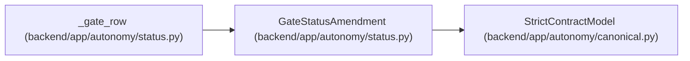

# GateStatusAmendment

**Location:** `backend/app/autonomy/status.py:94`
**Kind:** Pydantic model
**Bases:** `StrictContractModel`
**Module:** [status](../modules/status.md)

## Description

_Auto-generated from `GateStatusAmendment` in `backend/app/autonomy/status.py`._

## Attributes

| Name | Type | Wire name | Required | Nullable | Default | Constraints | Examples | Description |
|------|------|-----------|----------|----------|---------|-------------|-------------|----------|
| `gate_id` | `str` | `gate_id` | Yes | No | — | pattern=unknown (IDENTIFIER_PATTERN) | — | — |
| `gate_state` | `Literal['gate_passed', 'gate_pending']` | `gate_state` | Yes | No | — | — | — | — |
| `required_evidence_kinds` | `tuple[str, ...]` | `required_evidence_kinds` | Yes | No | — | — | — | — |
| `satisfied_evidence` | `tuple[StatusEvidenceReference, ...]` | `satisfied_evidence` | Yes | No | — | — | — | — |
| `missing_evidence_kinds` | `tuple[str, ...]` | `missing_evidence_kinds` | Yes | No | — | — | — | — |
| `next_tasks` | `tuple[str, ...]` | `next_tasks` | Yes | No | — | — | — | — |
| `terminal_boundary` | `Literal['manual_external', 'external_post_publication'] \| None` | `terminal_boundary` | Yes | Yes | — | — | — | — |

## Methods

*No public methods. Inherits from base classes.*

## Relationships

<!-- Auto-generated relationship summary. Do not edit by hand. -->

### Summary

| Module | Methods | Attributes |
|---|---:|---|
| [status](../modules/status.md) | 0 | `gate_id`, `gate_state`, `missing_evidence_kinds`, `next_tasks`, `required_evidence_kinds`, `satisfied_evidence`, `terminal_boundary` |

### Structure

| Kind | Entity | Module |
|---|---|---|
| Base | `StrictContractModel` | [autonomy_canonical](../modules/autonomy_canonical.md) |

### References

| Reference | Kind | Source | Call sites |
|---|---|---|---:|
| `_gate_row` | call | [status](../modules/status.md) | 1 |
| `_gate_row` | type_reference | [status](../modules/status.md) | — |
