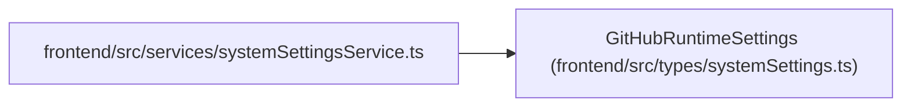

# GitHubRuntimeSettings

**Location:** `frontend/src/types/systemSettings.ts:39`
**Kind:** Class
**Bases:** —
**Module:** [systemSettings](../modules/systemSettings.md)

## Description

_Auto-generated from `GitHubRuntimeSettings` in `frontend/src/types/systemSettings.ts`._

## Attributes

| Name | Type | Required | Default | Description |
|------|------|----------|---------|-------------|
| `api_url` | `string` | Yes | — | — |
| `request_timeout_seconds` | `number` | Yes | — | — |
| `webhook_create_triage_for_unmatched` | `boolean` | Yes | — | — |
| `has_token` | `boolean` | Yes | — | — |
| `has_webhook_secret` | `boolean` | Yes | — | — |
| `field_sources` | `Record<string, RuntimeSettingSource>` | Yes | — | — |

## Methods

*No public methods. Inherits from base classes.*

## Relationships

<!-- Auto-generated relationship summary. Do not edit by hand. -->

### Summary

| Module | Methods | Attributes |
|---|---:|---|
| [systemSettings](../modules/systemSettings.md) | 0 | `api_url`, `field_sources`, `has_token`, `has_webhook_secret`, `request_timeout_seconds`, `webhook_create_triage_for_unmatched` |

### References

| Reference | Kind | Source | Call sites |
|---|---|---|---:|
| `systemSettingsService` | import | [systemSettingsService](../modules/systemSettingsService.md) | — |
