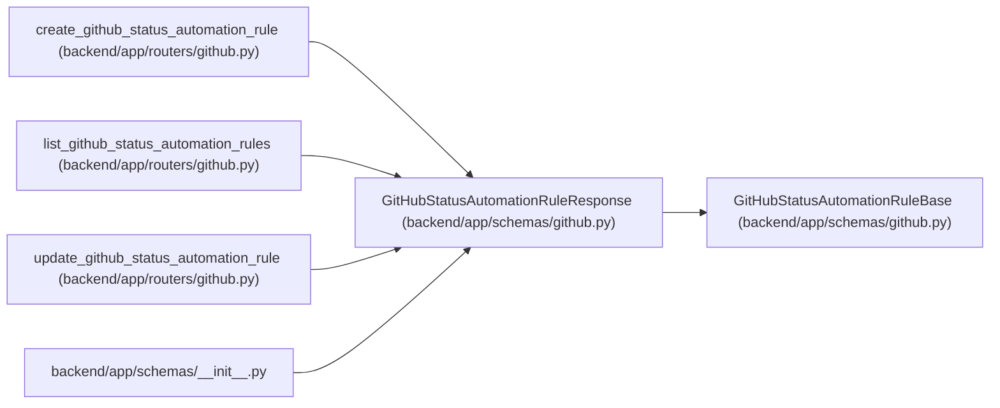

# GitHubStatusAutomationRuleResponse

**Location:** `backend/app/schemas/github.py:50`
**Kind:** Pydantic model
**Bases:** `GitHubStatusAutomationRuleBase`
**Module:** [schemas_github](../modules/schemas_github.md)

## Description

Response for one GitHub status automation rule.

## Model Configuration

| Setting | Value | Source |
|---------|-------|--------|
| `from_attributes` | `True` | config_class |

## Attributes

| Name | Type | Wire name | Required | Nullable | Default | Constraints | Examples | Description |
|------|------|-----------|----------|----------|---------|-------------|-------------|----------|
| `id` | `int` | `id` | Yes | No | — | — | — | — |
| `created_at` | `datetime` | `created_at` | Yes | No | — | — | — | — |
| `updated_at` | `datetime` | `updated_at` | Yes | No | — | — | — | — |

## Methods

*No public methods. Inherits from base classes.*

## Relationships

<!-- Auto-generated relationship summary. Do not edit by hand. -->

### Summary

| Module | Methods | Attributes |
|---|---:|---|
| [schemas_github](../modules/schemas_github.md) | 0 | `created_at`, `id`, `updated_at` |

### Structure

| Kind | Entity | Module |
|---|---|---|
| Base | `GitHubStatusAutomationRuleBase` | [schemas_github](../modules/schemas_github.md) |

### References

| Reference | Kind | Source | Call sites |
|---|---|---|---:|
| `create_github_status_automation_rule` | type_reference | [routers_github](../modules/routers_github.md) | — |
| `list_github_status_automation_rules` | type_reference | [routers_github](../modules/routers_github.md) | — |
| `update_github_status_automation_rule` | type_reference | [routers_github](../modules/routers_github.md) | — |
| `__init__` | import | [schemas___init__](../modules/schemas___init__.md) | — |
