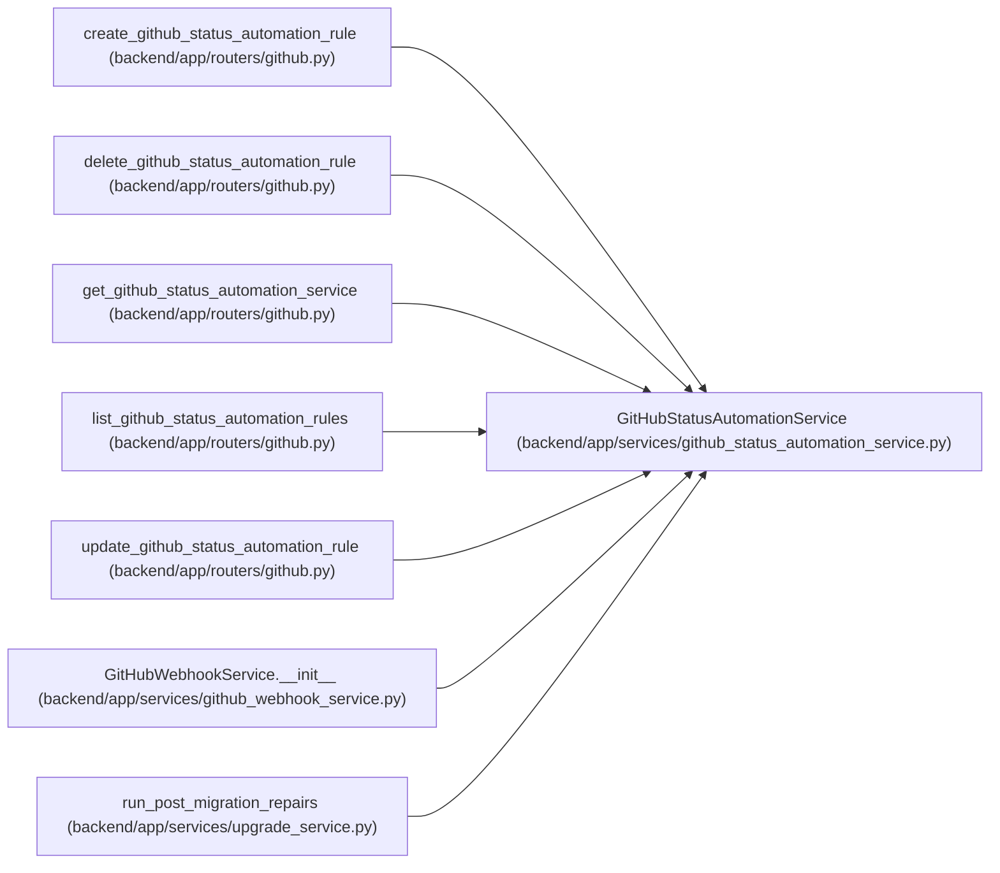

# GitHubStatusAutomationService

**Location:** `backend/app/services/github_status_automation_service.py:77`
**Kind:** Class
**Bases:** —
**Module:** [github_status_automation_service](../modules/github_status_automation_service.md)

## Description

Manage and apply GitHub status automation rules.

## Attributes

*No annotated attributes found.*

## Methods

| Method | Signature | Decorators | Description |
|--------|-----------|------------|-------------|
| `__init__` | `(db: AsyncSession)` | — | — |
| `list_rules` | *(async)* `() -> list[GitHubStatusAutomationRule]` | — | List all automation rules in execution order. |
| `list_enabled_for_event` | *(async)* `(github_event_type: str) -> list[GitHubStatusAutomationRule]` | — | List enabled rules for one GitHub task event type. |
| `get_rule` | *(async)* `(rule_id: int) -> Optional[GitHubStatusAutomationRule]` | — | Fetch one automation rule by ID. |
| `create_rule` | *(async)* `(data: GitHubStatusAutomationRuleCreate) -> GitHubStatusAutomationRule` | — | Create an automation rule. |
| `update_rule` | *(async)* `(rule_id: int, data: GitHubStatusAutomationRuleUpdate) -> Optional[GitHubStatusAutomationRule]` | — | Update an automation rule. |
| `delete_rule` | *(async)* `(rule_id: int) -> bool` | — | Delete an automation rule. |
| `seed_default_rules` | *(async)* `() -> None` | — | Seed disabled default automation rules without overwriting user edits. |
| `_event_exists` | *(async)* `(idempotency_key: Optional[str]) -> bool` | — | — |
| `_automation_key` | `(delivery_id: Optional[str], rule_id: int) -> Optional[str]` | — | — |
| `_render_reason` | `(rule: GitHubStatusAutomationRule, context: dict[str, Any], ui_language: LanguageCode = 'en') -> str` | — | — |
| `_record_failure_event` | *(async)* `(*, task_id: int, rule: GitHubStatusAutomationRule, from_status: str, reason: str, error: str, context: dict[str, Any], idempotency_key: Optional[str], ui_language: LanguageCode) -> None` | — | — |
| `apply_rules` | *(async)* `(*, task_id: int, github_event_type: str, delivery_id: Optional[str], context: dict[str, Any], commit: bool = True) -> list[GitHubStatusAutomationResult]` | — | Apply enabled rules for a matched GitHub webhook event. |

## Relationships

<!-- Auto-generated relationship summary. Do not edit by hand. -->

### Summary

| Module | Methods | Attributes |
|---|---:|---|
| [github_status_automation_service](../modules/github_status_automation_service.md) | 13 | — |

### References

| Reference | Kind | Source | Call sites |
|---|---|---|---:|
| `create_github_status_automation_rule` | type_reference | [routers_github](../modules/routers_github.md) | — |
| `delete_github_status_automation_rule` | type_reference | [routers_github](../modules/routers_github.md) | — |
| `get_github_status_automation_service` | call | [routers_github](../modules/routers_github.md) | 1 |
| `get_github_status_automation_service` | type_reference | [routers_github](../modules/routers_github.md) | — |
| `list_github_status_automation_rules` | type_reference | [routers_github](../modules/routers_github.md) | — |
| `update_github_status_automation_rule` | type_reference | [routers_github](../modules/routers_github.md) | — |
| `GitHubWebhookService.__init__` | call | [github_webhook_service](../modules/github_webhook_service.md) | 1 |
| `run_post_migration_repairs` | call | [upgrade_service](../modules/upgrade_service.md) | 1 |
